# 深度学习即插即用模块库

> 共 **123** 个模块 | 89 个有结构图 | 44 个有详解+代码

## 目录

- [一、Mamba系列模块](#一-Mamba系列模块)（5 个模块）
- [二、卷积（CNN）系列模块](#二-卷积（CNN）系列模块)（25 个模块）
- [三、频域系列模块](#三-频域系列模块)（10 个模块）
- [四、特征融合系列模块](#四-特征融合系列模块)（13 个模块）
- [五、下采样系列模块](#五-下采样系列模块)（8 个模块）
- [六、注意力系列模块](#六-注意力系列模块)（46 个模块）
- [七：时间序列模块](#七、时间序列模块)（16 个模块）

---

# 一、Mamba系列模块

## 1.ConvSSM模块

### 论文：Convolutional State Space Models for Long-Range Spatiotemporal Modeling [arxiv.org](https://arxiv.org/pdf/2310.19694v1)

> 模块简介：一个来自于Mamba领域的即插即用模块，CV二维图像任务通用，ConvSSM模型结合卷积递归更新与状态空间模型（SSM），通过并行化实现高效处理长序列的能力，计算复杂度为子平方级。其点卷积设计避免内核膨胀，堆叠多层扩展感受野，同时通过SSM的参数化策略增强对长时空依赖的建模效果。ConvSSM在训练和推理效率上大幅领先传统方法，训练速度比ConvLSTM快3倍，生成速度比Transformers快400倍，并在Moving-MNIST、DMLab等任务中表现优异。适用于需要同时建模空间和长时间序列的场景，如视频预测、天气预报、交通流量建模等复杂时空任务。

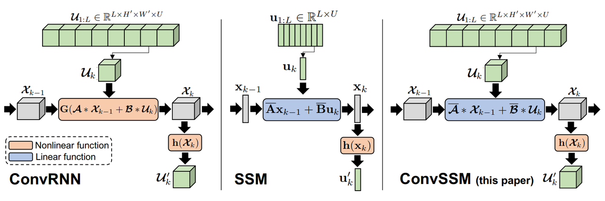

## 2.MambaIR模块

### 论文：MambaIR: A Simple Baseline for Image Restoration with State-Space Model [arxiv.org](https://arxiv.org/pdf/2402.15648v3)

> 模块简介：MambaIR 是一种基于状态空间模型（SSM）的图像恢复方法，兼具全局感受野和高效计算能力。其特点是引入残差状态空间块（RSSB），通过局部卷积增强邻域像素建模并减少通道冗余，同时采用通道注意力机制提高表达能力。MambaIR 具有线性复杂度，支持长依赖建模，性能超越 SwinIR 等主流基准，PSNR 提升达 0.45dB，计算开销相当。适用于超分辨率、去噪和JPEG压缩恢复等低层次视觉任务，尤其在高效计算和大规模全局建模需求场景下表现出色。

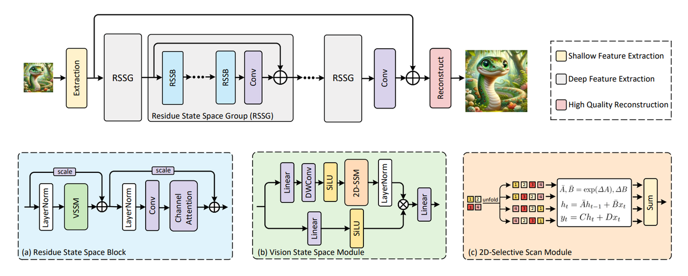

## 3.MambaTab模块

### 论文：MambaTab: A Simple Yet Effective Approach for Handling Tabular Data [1 Introduction](https://arxiv.org/html/2401.08867v1)

> 模块简介：MambaTab 是一种针对表格数据的高效深度学习方法，基于状态空间模型（SSM）的 Mamba 架构构建。其特点包括模型结构简单、参数需求极少（通常为 Transformer 基线的 1% 以下），并且支持增量特征学习和长依赖关系建模。MambaTab 无需复杂的数据预处理，能够直接处理表格数据，支持嵌入特征学习并通过残差连接扩展模型深度。实验结果显示，在8个公开数据集上的分类任务中，MambaTab 相较于最新的 Transformer 和 CNN 基础模型在性能上有显著提升，尤其在增量学习场景中表现优异。适用于工业、医疗和其他需要高效表格数据分析的场景。

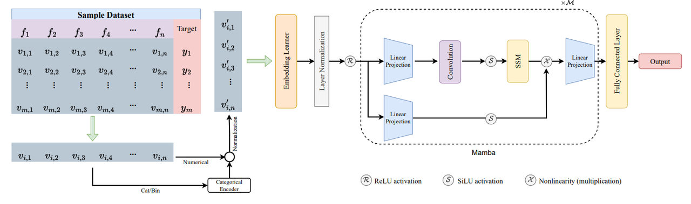

## 4.nnMamba模块

### 论文：nnMamba: 3D Biomedical Image Segmentation, Classification and Landmark Detection with State Space Model [arxiv.org](https://arxiv.org/pdf/2402.03526v2)

> 模块简介：它采用Channel-Spatial Siamese模块强化长距离关系建模，通过MICCSS模块稳定训练，并设计层次化序列学习方法。该模块在3D生物医学任务中表现优异，尤其在密集预测和分类上效果突出，能显著提升脑肿瘤分割、阿尔茨海默病分类及地标检测的精度。nnMamba适用于医学图像分析领域，如MRI、CT图像的肿瘤分割、疾病分类及地标识别等场景。

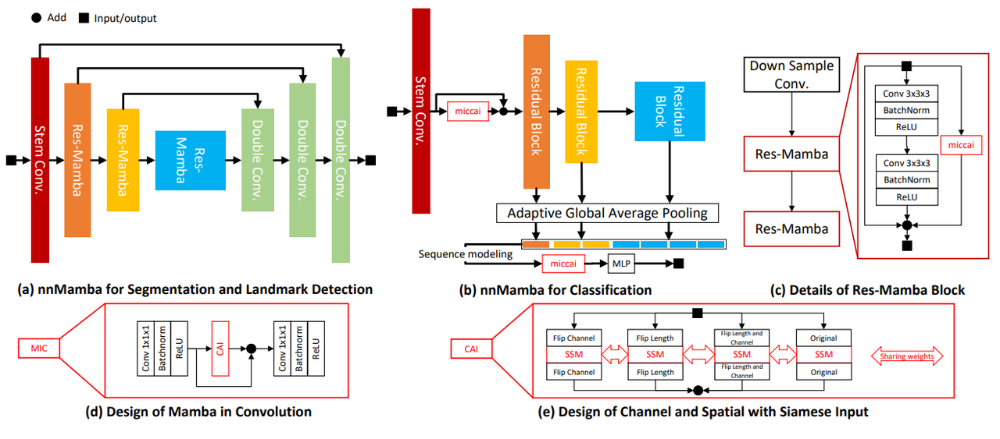

## 5.ZigMa模块

### 论文：ZigMa: A DiT-style Zigzag Mamba Diffusion Model [arxiv.org](https://arxiv.org/pdf/2403.13802v3)

> 模块简介：ZigMa模块特点在于其灵活性和高效性，通过放松SSM参数的时间不变性约束，引入工作高效的并行扫描，优化连续空间填充路径。ZigMa在视频生成、多模态图像生成等任务中效果显著，能有效降低FID等指标，提升生成质量。它适用于视频处理、图像生成及多模态数据分析等场景，如视频超分辨率、多模态图像合成及跨模态检索等任务。

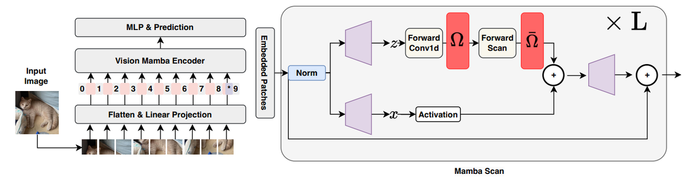

# 二、卷积（CNN）系列模块

## 1.AKConv模块

### 论文：AKConv: Convolutional Kernel with Arbitrary Sampled Shapes and Arbitrary Number of Parameters [arxiv.org](https://arxiv.org/pdf/2311.11587v1)

> 模块简介：AKConv模块特点在于其能使用任意数量和形状的卷积核进行高效特征提取，通过不规则卷积操作提供更多探索选项。在目标检测任务中，AKConv能显著提升检测精度，如COCO2017、VOC 7+12等数据集上表现优异。它适用于各种目标检测场景，特别是需要高精度检测且对象形状多样的情况，如无人机拍摄、复杂环境监控等。

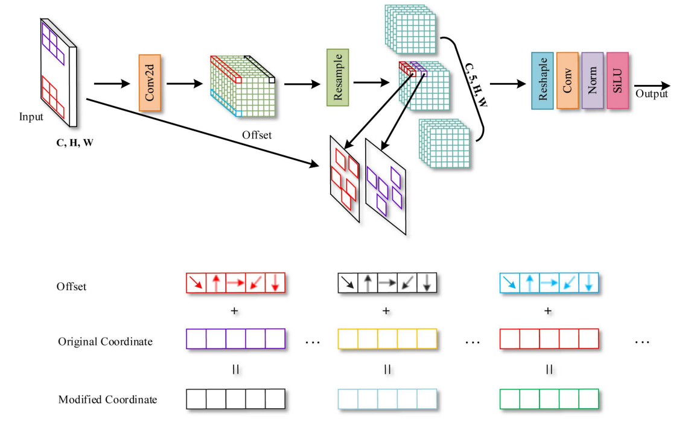

## 2.ACNet模块

### 论文：ACNet: Strengthening the Kernel Skeletons for Powerful CNN via Asymmetric Convolution Blocks [arxiv.org](https://arxiv.org/pdf/1908.03930v3)

> 模块简介：ACNet模块的特点在于无需引入超参数，通过替换标准卷积层为ACB增强模型对旋转失真的鲁棒性。在CIFAR、ImageNet等数据集上，ACNet能显著提升模型准确率，且不影响推理速度。它适用于各种CNN架构的性能提升，尤其适用于需要高准确率且对计算资源有限制的场景，如移动端视觉任务、高效模型设计等。

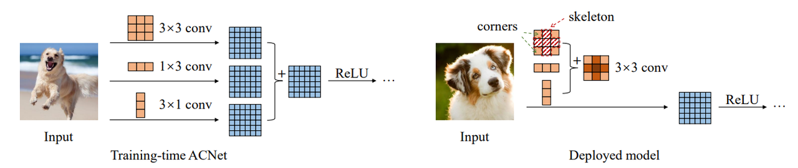

## 3.Run, Don't Walk模块

### 论文：Run, Don’t Walk: Chasing Higher FLOPS for Faster Neural Networks [arxiv.org](https://arxiv.org/pdf/2303.03667)

> 模块简介：论文介绍了FasterNet，一种通过优化FLOPS并提出部分卷积(PConv)来提高神经网络推理速度的新方法。作者强调了仅关注FLOPs可能忽视FLOPS的重要性，并展示了PConv在多个模型上的实验结果。

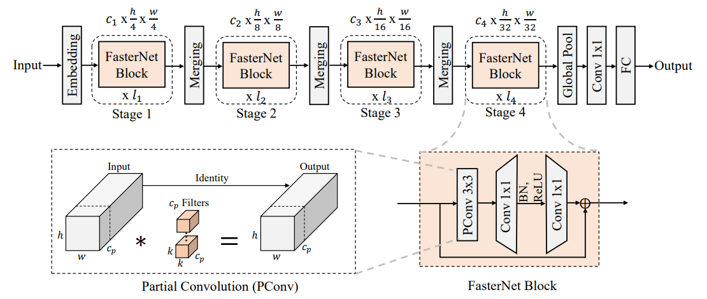

> :book: [机制详解](dl-modules/modules/cnn/run_don_t_walk/detailed.md)
> :computer: [Python代码](dl-modules/modules/cnn/run_don_t_walk/module.py)

## 4.CondConv模块

### 论文：CondConv: Conditionally Parameterized Convolutions for Efficient Inference [arxiv.org](https://arxiv.org/pdf/1904.04971v3)

> 模块简介：作者提出一种条件参数卷积，该卷积是一种即插即用的模块，它可以为每个样例学习一个特定的卷积核参数，通过替换标准卷积，CondConv可以提升模型的尺寸与容量，同时保持高效推理。作者证实：相比已有标准卷积网络，基于CondConv的网络在精度提升与推理耗时方面取得了均衡(即精度提升，但速度持平)。在ImageNet分类问题中，基于CondConv的EfficientNet-B0取得了78.3%的精度且仅有413M计算量。

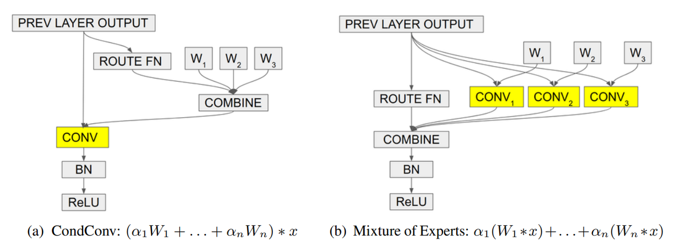

## 5.CoordGate模块

### 论文：CoordGate: Efficiently Computing Spatially-Varying Convolutions in Convolutional Neural Networks

### 代码地址：未公开

> 模块简介：本文提出了CoordGate，一种新颖的轻量级模块，它通过使用乘法门和坐标编码网络，有效地计算卷积神经网络（CNN）中的空间变化卷积。CoordGate允许基于它们的空间位置选择性地放大或衰减过滤器，从而有效地像局部连接的神经网络一样行动。通过在U-Net架构中实施CoordGate，并将其应用于图像去模糊这一挑战性问题，实验结果表明CoordGate优于传统方法，为各种计算机视觉应用中的CNN提供了一个更加健壮且具有空间意识的解决方案。

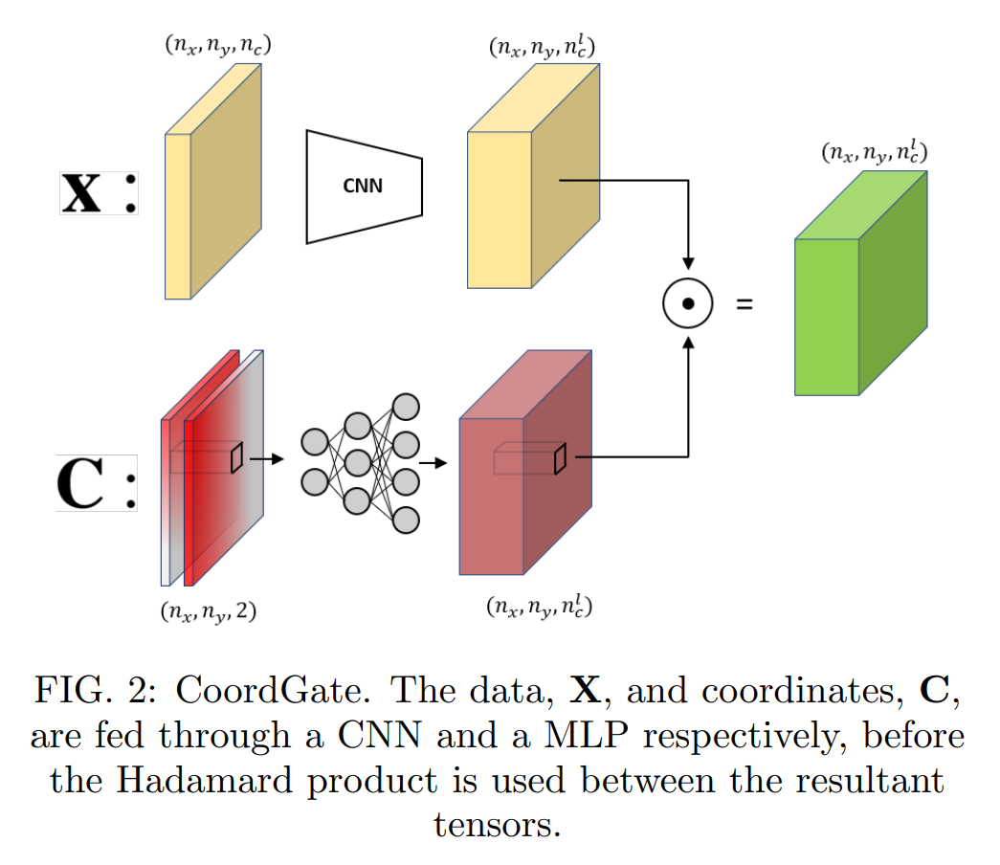

## 6.DO-Conv模块

### 论文：DO-Conv: Depthwise Over-parameterized Convolutional Layer [arxiv.org](https://arxiv.org/pdf/2006.12030v1)

> 模块简介：在这篇文章中，作者通过在一个普通的卷积层中加入额外的depthwise卷积操作，构成一个over-parameterized的卷积层，并将其命名为DO-Conv，通过实验证明，使用DO-Conv不仅能够加速网络的训练过程，还能在多种计算机视觉任务中取得比使用传统卷积层更好的结果。在推理时，DO-Conv可以转换为传统的卷积操作，因此将一个网络中的传统卷积替换为DO-Conv并不会增加计算需求。

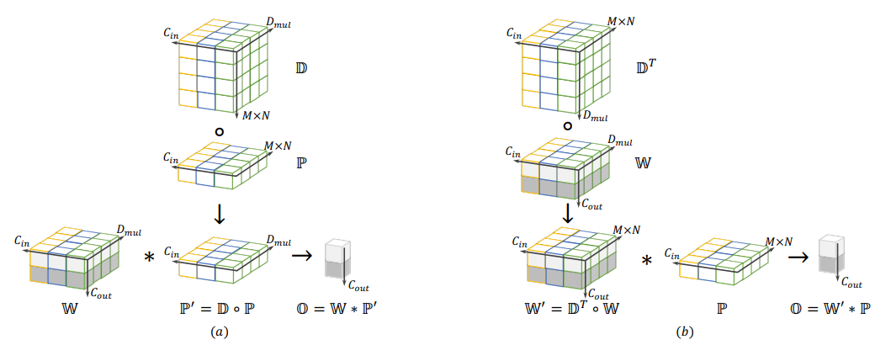

## 7.Dynamic Convolution模块

### 论文：Dynamic Convolution: Attention over Convolution Kernels [arxiv.org](https://arxiv.org/pdf/1912.03458v2)

> 模块简介：轻量级卷积神经网络（light-weight convolutional neural network）因其较低的计算预算而限制了 CNN 的深度（卷积层数）和宽度（通道数），不仅导致模型性能下降，表示能力也会受到限制。为了解决这个问题，微软的研究员们提出了动态卷积，这种新的设计能够在不增加网络深度或宽度的情况下增加模型的表达能力（representation capacity）。动态卷积的基本思路就是根据输入图像，自适应地调整卷积参数。（所得卷积核与输入相关，即不同数据具有不同的卷积，这也就是动态卷积的由来。）

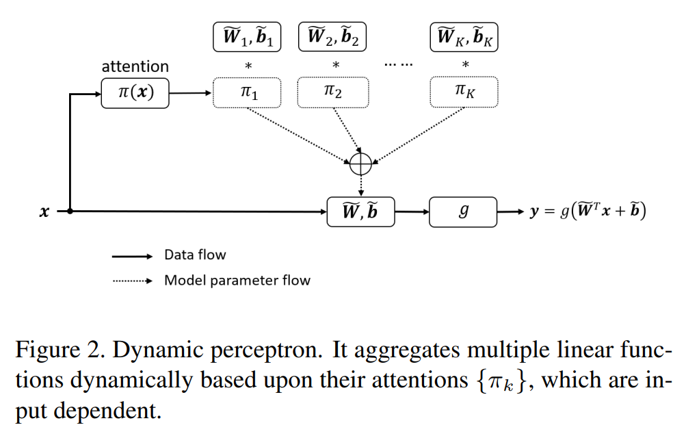

## 8.DCNv4模块

### 论文：Efficient Deformable ConvNets: Rethinking Dynamic and Sparse Operator for Vision Applications [arxiv.org](https://arxiv.org/pdf/2401.06197v1)

> 模块简介：本文介绍了一种高效和有效的算子DCNv 4，它是专为广泛的视觉应用而设计的。与其前身DCNv 3相比，DCNv 4有两个关键增强功能：(1) 去除空间聚合中的softmax归一化，以增强其动态性和表达能力；(2) 优化存储器访问以最小化冗余操作以加速。这些改进显著加快了收敛速度，并大幅提高了处理速度，DCNv 4实现了三倍以上的前向速度。
> 
> 在各种任务中，包括图像分类、实例和语义分割，特别是图像生成中，DCNv 4表现出卓越的性能。当集成到潜在扩散模型中的U-Net等生成模型中时，DCNv 4的性能优于其基线，强调了其增强生成模型的潜力。在实际应用中，在InternImage模型中使用DCNv 4替换DCNv 3创建FlashInternImage，可以在不进行进一步修改的情况下将速度提高高达80%，并进一步提高性能。DCNv 4的速度和效率的进步，以及其在各种视觉任务中的强大性能，显示出其作为未来视觉模型基础构建块的潜力。

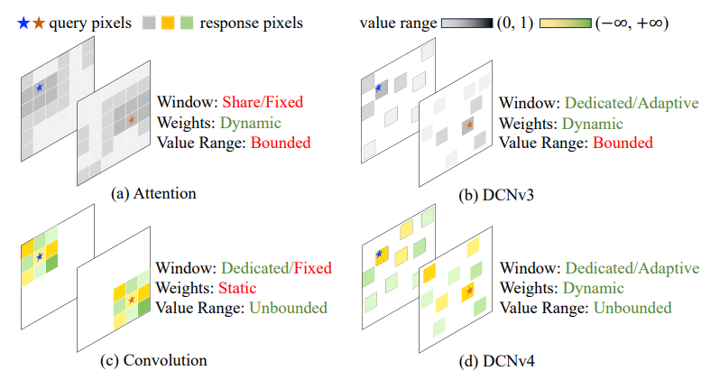

## 9.EfficientMod模块

### 论文：Efficient Modulation for Vision Networks [arxiv.org](https://arxiv.org/pdf/2403.19963v1)

> 模块简介：提出了一种高效调制模块(Efficient Modulation, EfficientMod)用于构建推理高效网络。受益于调制机制的突出的表达能力与高效设计理念，所提方案取得了更优的精度-效率均衡，在高效网络方面达成新的SOTA性能。当与自注意力相结合后，混合网络可以取得进一步的性能提升且不会造成效率损失。

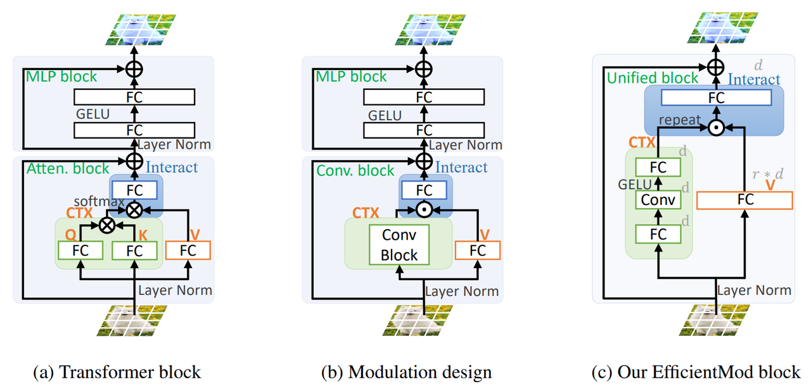

## 10.GhostNet模块

### 论文：GhostNet: More Features from Cheap Operations [arxiv.org](https://arxiv.org/pdf/1911.11907v2)

> 模块简介：GhostNet是一种轻量级的深度学习模型，通过GhostModule和GhostBottleNeck实现高效特征提取。GhostModule通过1x1卷积和深度可分离卷积生成更多特征图，减少参数量。GhostBottleNeck则是GhostModule的瓶颈结构，用于构建网络深度。GhostNet适用于资源有限的场景，如移动设备上的图像分类任务。

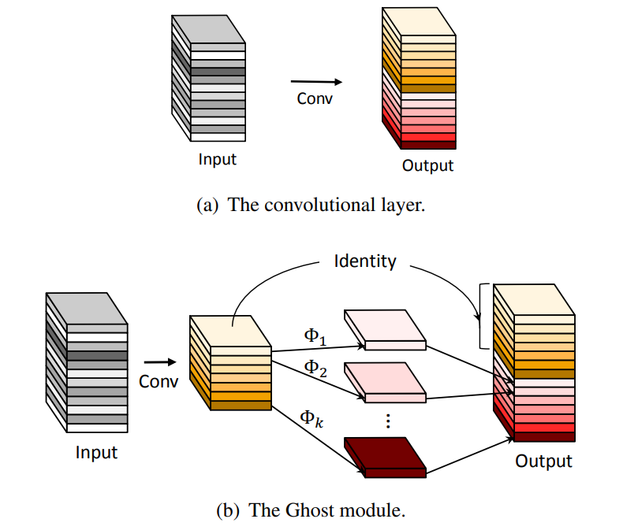

## 11.HetConv模块

### 论文：HetConv: Heterogeneous Kernel-Based Convolutions for Deep CNNs [arxiv.org](https://arxiv.org/pdf/1903.04120v2)

> 模块简介：本文通过对分组卷积的充分探索，提出了一种新的亲量化卷积方式—异构卷积（HetConv）。根据结构组成分析和计算量对比实验，HetConv只需更少的计算量便能获得更好的精度，优于主流的轻量化卷积。

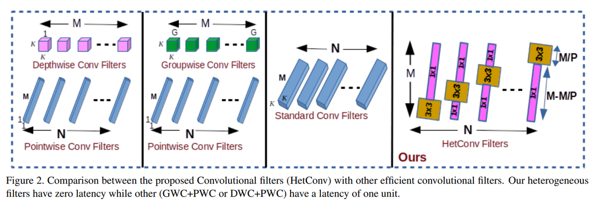

## 12.SCNet模块

### 论文：Improving Convolutional Networks With Self-Calibrated Convolutions [openaccess.thecvf.com](https://openaccess.thecvf.com/content_CVPR_2020/papers/Liu_Improving_Convolutional_Networks_With_Self-Calibrated_Convolutions_CVPR_2020_paper.pdf)

> 模块简介：本文提出了一种新颖的自校正卷积，该卷积它可以通过特征的内在通信达到扩增卷积感受野的目的，进而增强输出特征的多样性。不同于标准卷积采用小尺寸核（例如3×3卷积）同时融合空间维度域与通道维度的信息，本文所设计的SCConv可以通过自校正操作自适应地在每个空间位置周围建立了远程空间和通道间依存关系。因此，它可以帮助CNN生成更具判别能力的特征表达，因其具有更丰富的信息

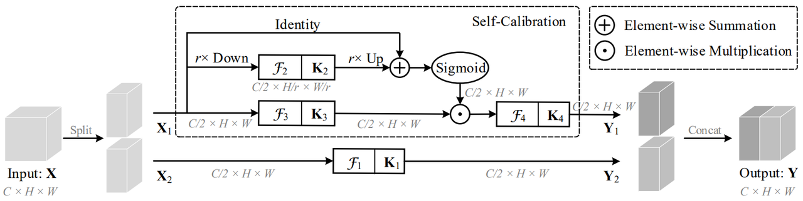

## 13.Involution模块

### 论文：Involution: Inverting the Inherence of Convolution for Visual Recognition [arxiv.org](https://arxiv.org/pdf/2103.06255v2)

> 模块简介：本文通过反转前述的卷积设计原理（称为卷积）提出了一种用于深度神经网络的新颖原子操作，并将其作为复杂化的实例插入到本文所提的involution卷积之中。大家可以将提出的involution算子作为基础以构建新一代神经网络，并在几种流行的Baseline（包括ImageNet分类，COCO检测和分割以及Cityscapes分割）上为不同的深度学习模型提供支持。

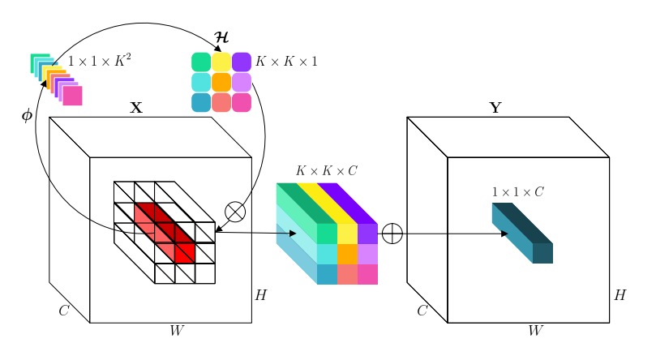

## 14.KernelWarehouse模块

### 论文：KernelWarehouse: Towards Parameter-Efficient Dynamic Convolution [arxiv.org](https://arxiv.org/pdf/2308.08361v1)

> 模块简介：本文介绍了KernelWarehouse，一种改进现代ConvNets性能的动态卷积方法。研究结果表明，在KernelWarehouse中增强更多核心单元之间的仓库共享通常会导致更好的性能。

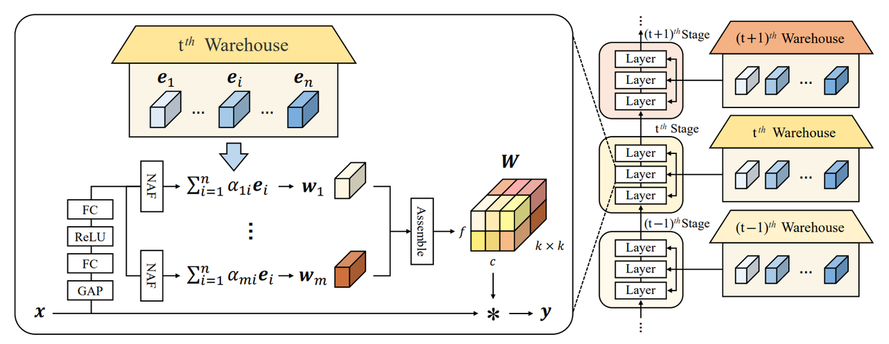

## 15.Drop an Octave模块

### 论文：Drop an Octave: Reducing Spatial Redundancy in Convolutional Neural Networks with Octave Convolution [arxiv.org](https://arxiv.org/pdf/1904.05049v3)

> 模块简介：提出了降低空间冗余的新方法。通过将特征图分解为高频和低频部分，使用不同维度的张量存储，有效处理高低频信息并减少计算成本。实验表明，该方法在处理大物体检测时表现优越，特别是在高分辨率图像上。

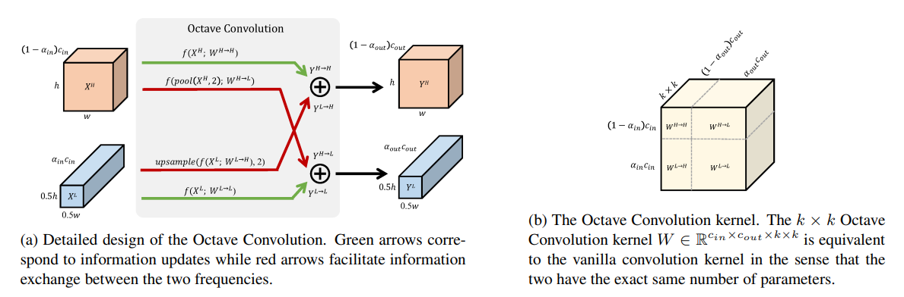

## 16.ODConv模块

### 论文：Omni-Dimensional Dynamic Convolution [arxiv.org](https://arxiv.org/pdf/2209.07947v1)

> 模块简介：ODConv是一种动态卷积算法，它的原理是在卷积过程中，根据输入数据的特征动态地调整卷积核的形状和大小，以适应不同的输入数据。具体来说，ODConv通过引入一个可学习的形变模块，根据输入数据的特征动态地调整卷积核的形状和大小，从而提高了卷积神经网络的性能。与CondConv和DyConv不同，ODConv不仅考虑了空间维度、输入通道维度和输出通道维度，还考虑了卷积核的形状和大小，因此可以更好地适应不同的输入数据。

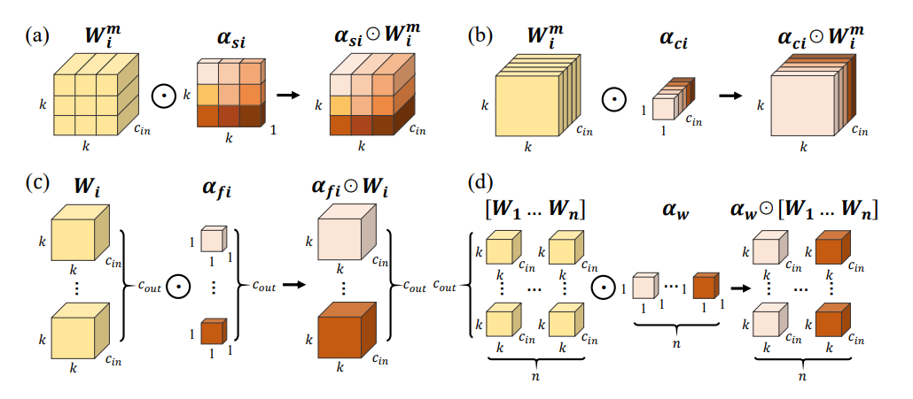

## 17.RefConv模块

### 论文：RefConv: Re-parameterized Refocusing Convolution for Powerful ConvNets [arxiv.org](https://arxiv.org/pdf/2310.10563v1)

> 模块简介：作者提出了一种可重参数化的重新聚焦卷积（RefConv），作为常规卷积层的即插即用替代品，能够在不引入额外推理成本的情况下显著提高基于CNN的模型性能。RefConv利用预训练参数编码的表示作为先验，通过重新聚焦这些参数来学习新的表示，进一步增强了模型结构的先验，提升了预训练模型的表示能力。实验证明，RefConv在图像分类、目标检测和语义分割等任务中表现出色，并能够减少通道冗余、平滑损失景观，从而解释了其有效性。

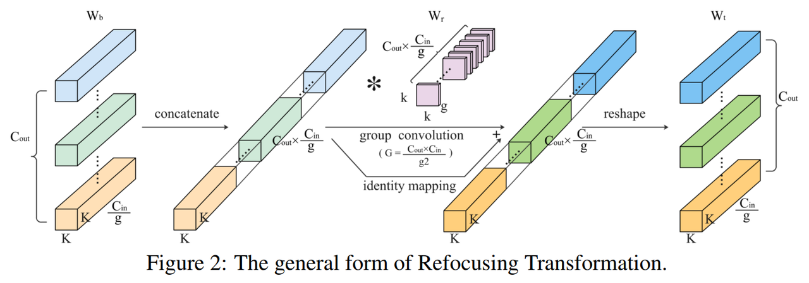

## 18.ResNeSt模块

### 论文：ResNeSt: Split-Attention Networks [arxiv.org](https://arxiv.org/pdf/2004.08955v2)

> 模块简介： 本文介绍了ResNeSt模型，一种基于split-attention的深度学习网络，其创新在于split(multi-branch)分组再拆分和Channel attention小组求权重再融合。通过详细解读代码和关键模块，如split-attention block，揭示了ResNeSt如何提高模型预测精度。文章还提供了模型的安装使用方法，并对比了ResNeSt与MobileNet V2的预测效果，以及探讨了dilated参数对模型的影响。

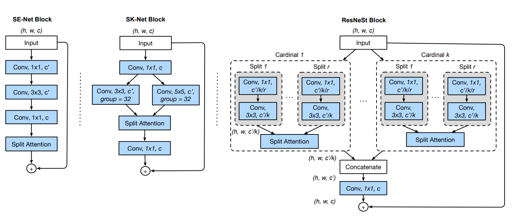

> :book: [机制详解](dl-modules/modules/cnn/resnest/detailed.md)
> :computer: [Python代码](dl-modules/modules/cnn/resnest/module.py)

## 19.SCConv模块

### 论文：SCConv: Spatial and Channel Reconstruction Convolution for Feature Redundancy [openaccess.thecvf.com](https://openaccess.thecvf.com//content/CVPR2023/papers/Li_SCConv_Spatial_and_Channel_Reconstruction_Convolution_for_Feature_Redundancy_CVPR_2023_paper.pdf)

> 模块简介：本文作者提出了一种名为 SCConv（Spatial and Channel reconstruction Convolution, 空间和通道重建卷积）的卷积模块，目的是减少卷积神经网络中特征之间的空间和通道冗余，从而压缩CNN模型并提高其性能。
> 
> 作者设计的 SCConv 模块，包含两个单元。一个名为 SRU (Spatial Reconstruction Unit, 空间重构单元) ，一个名为 CRU (Channel Reconstruction Unit, 通道重构单元) 。其中 SRU 通过 分离-重构方法 来减少空间冗余，CRU 则使用 分割-转换-融合方法 来减少通道冗余。这两个单元协同工作，以减少CNN中特征的冗余信息。
> 
> 作者指出，SCConv 是一种可以直接替代标准卷积操作的插件式卷积模块 ，可以应用于各种卷积神经网络中，从而降低冗余特征并减少计算复杂性。

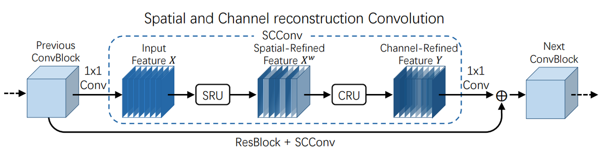

> :book: [机制详解](dl-modules/modules/cnn/scconv/detailed.md)
> :computer: [Python代码](dl-modules/modules/cnn/scconv/module.py)

## 20.UniRepLKNet模块

### 论文：UniRepLKNet: A Universal Perception Large-Kernel ConvNet for Audio, Video, Point Cloud, Time-Series and Image Recognition [arxiv.org](https://arxiv.org/pdf/2311.15599v2)

> 模块简介：用于大核CNN架构设计的四条guideline，一种名为UniRepLKNet的强力backbone（只用ImageNet-22K预训练，精度和速度SOTA，ImageNet达到88%, COCO达到56.4 box AP，ADE20K达到55.6 mIoU，实际测速优势很大），在时序预测的超大数据上用这一为图像设计的backbone达到SOTA水平（全球气温和风速预测，前SOTA是发在Nature子刊上专门为此设计的Transformer），在点云、音频、视频上凭着极为简单的预处理方式和毫无改变的模型结构均超过或接近SOTA水平。

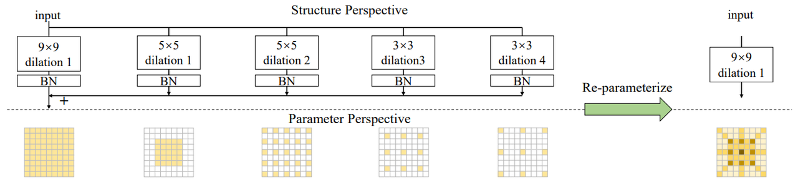

> ──────────────────────────────
> 以下 5 个模块来自详解文件，补充机制讲解与代码实现：

## 21.可变性卷积

### 论文：[InternImage: Exploring Large-Scale Vision Foundation Models with DeformableConvolutions](https://arxiv.org/abs/2211.05778)

> 模块简介：该文档介绍了一种基于卷积神经网络（CNNs）的大规模视觉基础模型，名为InternImage。与近年来取得巨大进展的大规模视觉变换器（ViTs）不同，基于CNN的大规模模型仍处于早期阶段。InternImage通过采用可变形卷积作为核心运算符，不仅具有执行下游任务（如检测和分割）所需的大有效接收场，而且还能够根据输入和任务信息进行自适应空间聚合。

> :book: [机制详解](dl-modules/modules/cnn/deformable_conv/detailed.md)
> :computer: [Python代码](dl-modules/modules/cnn/deformable_conv/module.py)

## 22.深度可分离卷积

### 论文：[DeepLab V3](https://arxiv.org/abs/1706.05587)

> 模块简介：DepthwiseSeparableConv模块主要用于执行深度可分离卷积操作，它是一种高效的卷积方法，广泛应用于减少模型参数数量、计算成本以及提高运行效率等场景，特别是在移动和嵌入式设备上的深度学习应用中。

> :book: [机制详解](dl-modules/modules/cnn/depthwise_separable_conv/detailed.md)
> :computer: [Python代码](dl-modules/modules/cnn/depthwise_separable_conv/module.py)

## 23.空洞卷积

### 论文：[MULTI-SCALE CONTEXT AGGREGATION BY DILATED CONVOLUTIONS](https://arxiv.org/abs/1511.07122)

> 模块简介：膨胀卷积旨在通过扩大卷积核的感受野而不增加参数数量或计算量，提高模型对多尺度上下文信息的捕获能力。这在处理图像和语音信号时特别有效，能够在细节和全局信息间建立更好的平衡。

> :book: [机制详解](dl-modules/modules/cnn/dilated_conv/detailed.md)
> :computer: [Python代码](dl-modules/modules/cnn/dilated_conv/module.py)

## 24.蛇形卷积

### 论文：[Dynamic Snake Convolution based on Topological Geometric Constraints for TubularStructure Segmentation](https://arxiv.org/abs/2307.08388)

> 模块简介：本文提出了一种新的框架DSCNet，旨在精确分割拓扑管状结构，如血管和道路。这些结构在临床应用和遥感应用中至关重要，准确的分割对于下游任务的精确性和效率至关重要。

> :book: [机制详解](dl-modules/modules/cnn/snake_conv/detailed.md)
> :computer: [Python代码](dl-modules/modules/cnn/snake_conv/module.py)

## 25.Temporal_conv卷积

### 论文：[Connecting the Dots: Multivariate Time Series Forecasting with Graph Neural Networks](https://arxiv.org/abs/2005.11650)

> 模块简介：MTGNN框架旨在通过利用多图卷积网络来预测交通流量，通过考虑空间-时间相关性和交通网络中的动态变化，以提高交通预测的准确性。

> :book: [机制详解](dl-modules/modules/cnn/temporal_conv/detailed.md)
> :computer: [Python代码](dl-modules/modules/cnn/temporal_conv/module.py)

# 三、频域系列模块

## 1.AFNO模块

### 论文：Adaptive Fourier Neural Operators: Efficient Token Mixers for Transformers [arxiv.org](https://arxiv.org/pdf/2111.13587v2)

> 模块简介：本文提出了一种借助傅里叶变换的高效 token mixer，AFNO。模型可以灵活地适应输入分辨率的变化，并且随着输入分辨率的增加呈 quasi-linear 增长。AFNO 通过对复数权重进行分块操作，一方面融合不同 channel 的信息，另一方面控制参数量的增

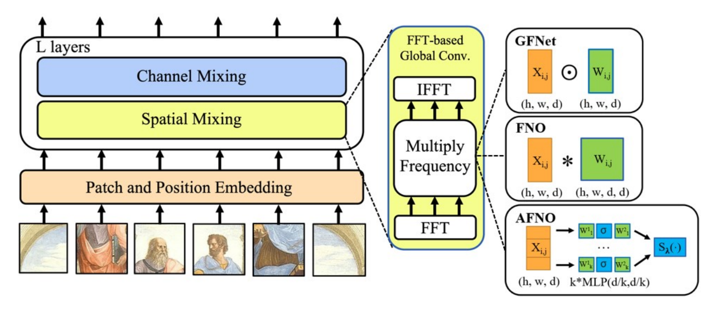

## 2.AFFNet模块

### 论文：Adaptive Frequency Filters As Efficient Global Token Mixers [arxiv.org](https://arxiv.org/pdf/2307.14008v1)

> 模块简介：AFFNet 设计了一种自适应频段过滤算子：Adaptive Frequency Filtering token mixer。视觉 Transformer，Large-Kernel CNN 和 MLP 在很多视觉任务上面都取得了成功，归功于它们的 token mixer 在全局范围内的信息融合。但是这些 token mixer 的成本较高，在移动设备上的高效部署存在一定的挑战。自适应频段过滤算子就是为了解决这个问题，它通过傅里叶变换 (Fourier transform) 将特征变换到频域，并利用下面关系在数学上的等价：
> 
> 在频域中 "通过逐位置的乘法操作过滤不同频段的特征"。
> 
> 在空域中 "用一个动态卷积核执行特征混合操作，卷积核的大小为特征的大小"。

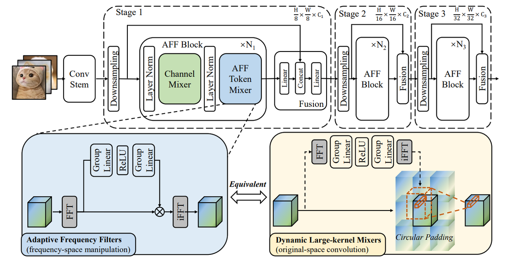

## 3.FFT模块

### 论文：FFT-based Dynamic Token Mixer for Vision [arxiv.org](https://arxiv.org/pdf/2303.03932v2)

> 模块简介：提出了一种名为动态滤波器、DFFormer和CDFFFormer的新型令牌混合器，使用动态滤波器来弥合上述差距的图像识别模型。CDFFormer实现了85.0%的Top-1精度，接近卷积和MHSA的混合架构。其他广泛的实验和分析，包括对象检测和语义分割，表明它们与最先进的架构具有竞争力；在处理高分辨率图像识别时，它们的吞吐量和内存效率是卷积和MHSA，与ConvFormer没有太大区别，远远优于CAFormer。我们的结果表明，动态过滤器是应该认真考虑的令牌混合器选项之一。

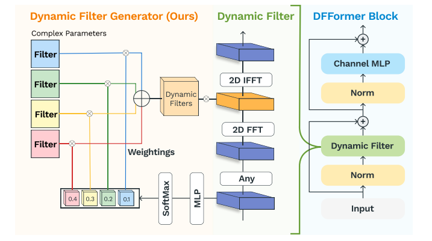

## 4.FlashFFTConv模块

### 论文：FlashFFTConv: Efficient Convolutions for Long Sequences with Tensor Cores [arxiv.org](https://arxiv.org/pdf/2311.05908v1)

> 模块简介：FlashFFTConv 是一个高效的卷积算法实现，专为加速长序列深度卷积而设计，利用FFT（快速傅里叶变换）算法并优化了GPU上的执行效率。相比于PyTorch标准FFT卷积，它在性能上实现了高达7.93倍的加速，内存使用减少至最多8.21倍。此库特别适用于处理长度可达4,194,304的卷积核，且对于较短的一维深度卷积（如卷积核长度在3到5个数量级），提供速度提升约7倍的解决方案，非常适合用于语言模型如Monarch Mixer、H3和Hyena的加速。

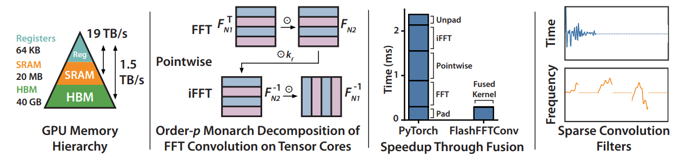

## 5.FourCastNet模块

### 论文：FourCastNet: A Global Data-driven High-resolution Weather Model using Adaptive Fourier Neural Operators [arxiv.org](https://arxiv.org/pdf/2202.11214v1)

> 模块简介：FourCastNet（傅里叶预测神经网络）是一个数据驱动的全球天气预报模型，由NVIDIA、劳伦斯伯克利国家实验室、密歇根大学安阿伯和赖斯大学的研究人员开发。它提供了关键全球天气指标的中期预报，分辨率为0.25°。相当于赤道附近约30公里x30公里的空间分辨率和大小为720 x 1440像素的全球网格。与传统的NWP模型相比，该模型的预报速度提高了45000倍，2秒内生成一周的天气预报，预报精度与最先进的数值天气预报模型ECMWF综合预报系统（IFS）相当。这是第一个可以直接与IFS系统进行比较的AI天气预报模型。

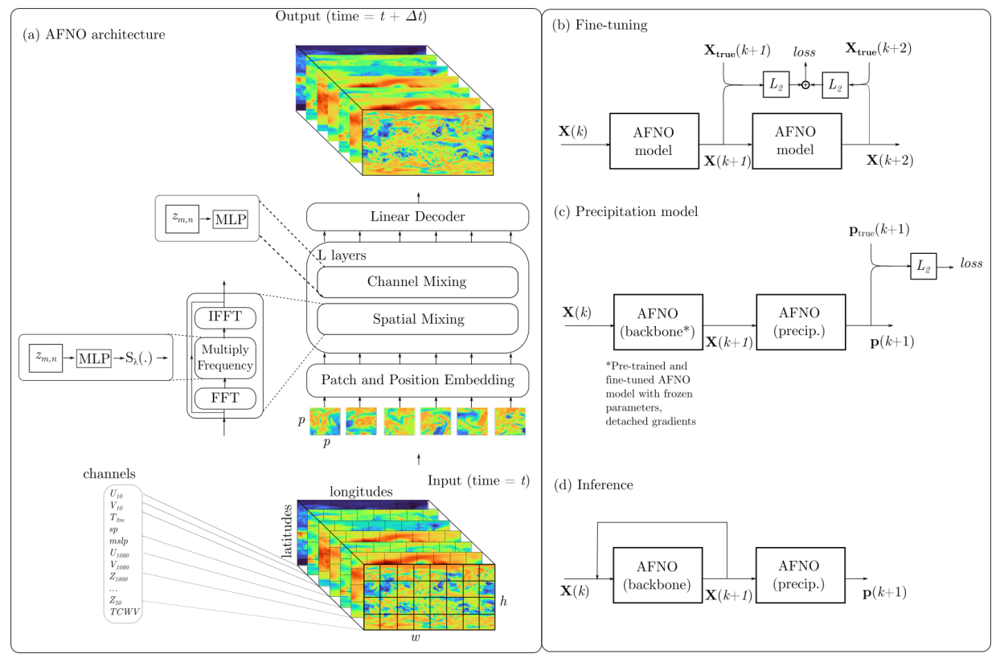

## 6.FourierGNN模块

### 论文：FourierGNN: Rethinking Multivariate Time Series Forecasting from a Pure Graph Perspective [arxiv.org](https://arxiv.org/pdf/2311.06190v1)

> 模块简介：提出了一种新的傅立叶图神经网络(FourierGNN)架构，通过堆叠我们提出的傅立叶图算子(FGO)在傅立叶空间中执行矩阵乘法。FourierGNN具有较强的表达能力和较低的复杂度，能够有效地完成预测。此外，我们的理论分析揭示了FGO在时域上与图卷积的等价性，进一步验证了FourierGNN的有效性。在七个数据集上进行的大量实验表明，与最先进的方法相比，我们的性能更优，效率更高，参数更少

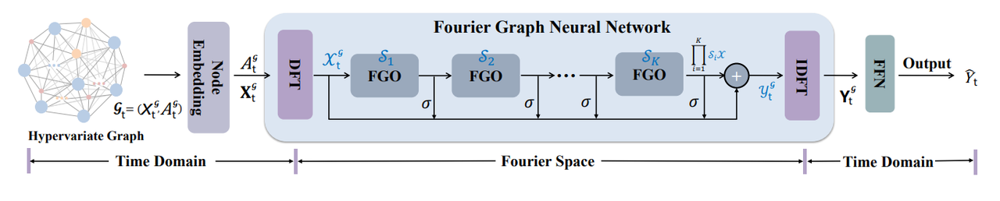

## 7.GFNet模块

### 论文：Global Filter Networks for Image Classification [arxiv.org](https://arxiv.org/pdf/2107.00645v2)

> 模块简介：本文是清华大学在MLP方面的探索，不用现有MLP方案在空域进行token间信息交换，提出了一种全局滤波器方案在频域进行token间信息交换。受益于FFT的log-linear计算复杂度，GFNet可以设计成分层架构形式，能够更高分辨率作为起点，比如。虽然这篇文章的指标对比最新的VOLO、ViP等不算高，不过它为相关架构设计提供了一个非常不错的思路，值得学习。

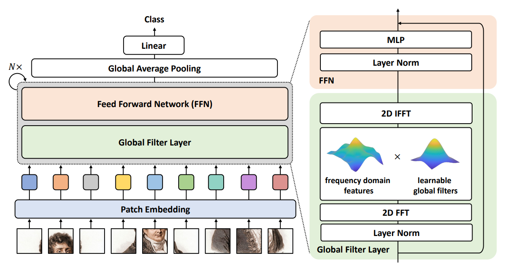

## 8.SpectFormer模块

### 论文：SpectFormer: Frequency and Attention is what you need in a Vision Transformer [arxiv.org](https://arxiv.org/pdf/2304.06446v2)

> 模块简介：SpectFormer是一种新的Transformer架构，结合了频域层和多头自注意力层，以提升图像识别任务的性能。研究表明，这种混合设计能更好地捕获图像的全局和局部特征，提高模型的准确性。在ImageNet上，SpectFormer达到了85.7%的Top-1精度，显示了其潜在优势。

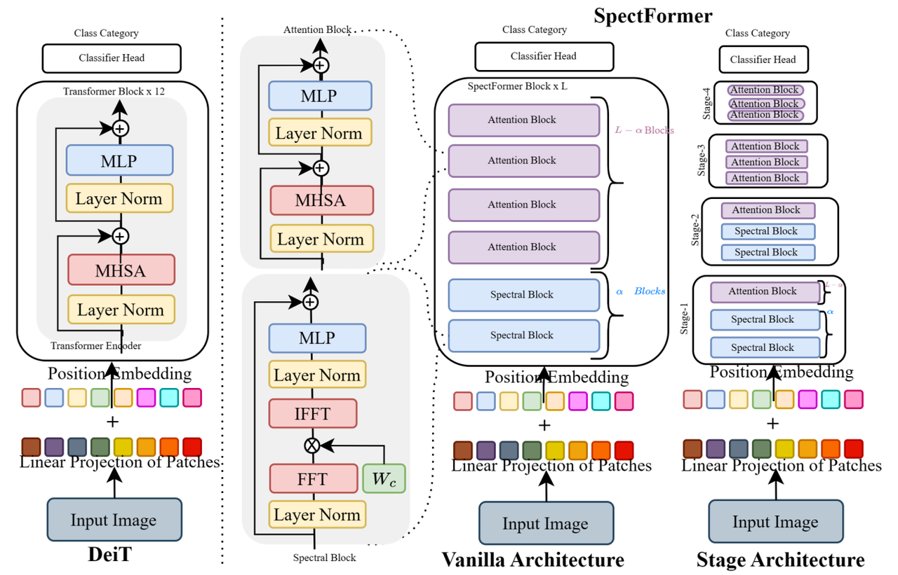

## 9.TimesNet模块

### 论文：TimesNet: Temporal 2D-Variation Modeling for General Time Series Analysis [arxiv.org](https://arxiv.org/pdf/2210.02186v3)

> 模块简介：文中提出了将TimesBlock作为时间序列分析的任务通用主干的TimesNet。TimesBlock可以自适应地发现多周期性，并通过参数有效的起始块从变换后的2D张量中提取复杂的时间变化。并在五个主流任务（包括短期和长期预测、插补、分类、异常检测）中取得sota的结果

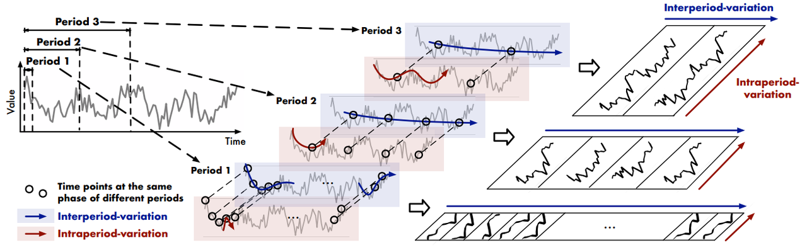

> ──────────────────────────────
> 以下 1 个模块来自详解文件，补充机制讲解与代码实现：

## 10.fcanet

### 论文：[FcaNet: Frequency Channel Attention Networks](https://arxiv.org/abs/2012.11879)

> 模块简介：FcaNet 通过采用频率通道注意力机制，显著提高了图像识别和分类任务的性能。该网络通过在频率域而不是传统的空间域对特征进行建模，使得网络能够更有效地捕捉到图像的细节和纹理信息。

> :book: [机制详解](dl-modules/modules/frequency/fcanet/detailed.md)
> :computer: [Python代码](dl-modules/modules/frequency/fcanet/module.py)

# 四、特征融合系列模块

## 1.Adaptive Fusion Techniques for Multimodal Data

### 论文：Adaptive Fusion Techniques for Multimodal Data [arxiv.org](https://arxiv.org/pdf/1911.03821v2)

### 代码地址：未公开

> 模块简介：在本文当中，我们提出了一种自适应的融合技术，旨在从不同的模式有效地建模上下文，本文没有为网络定义一个确定性的融合操作，例如连接，而是让网络决定“如何”更有效地组合一组给定的多模态特征。我们提出了两种网络:1)自动融合，它学习压缩来自不同模式的信息，同时保留上下文;2)GAN融合，它从互补的模式中规则化给定上下文的学习潜在空间。对多模态机器翻译和情感识别任务的定量评估表明，与现有方法相比，我们轻量级的自适应网络可以更好地从其他模式建模上下文，其中许多方法采用了大规模的基于transformer的网络。

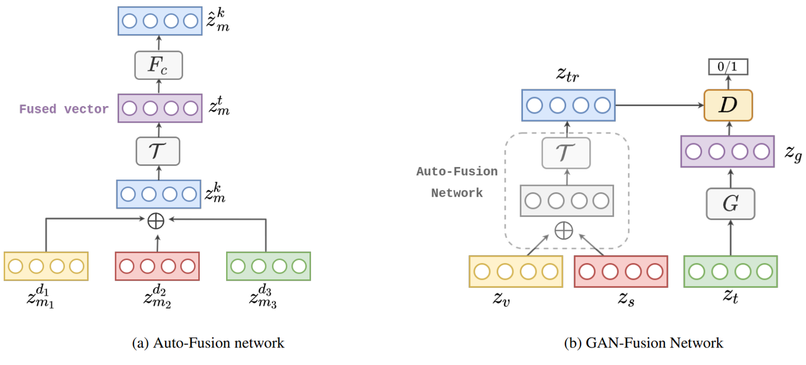

## 2.CentralNet模块

### 论文：CentralNet: a Multilayer Approach for Multimodal Fusion [arxiv.org](https://arxiv.org/pdf/1808.07275v1)

> 模块简介：Concate的方法相当于在各自模态的特征分别独立抽取之后做融合，但是不干预特征抽取的过程。这显然会漏掉一些不同模态之间的相关性的信息，比如，一个人尖叫的视频片段，里面有人的嘴巴长得很大的这种视觉特征，也会有尖叫声这种声音特征，这两种特征出现的时间都是相关连的。如果在抽取特征的过程中，相互有一个监督或者借鉴的关系，那样应该会更好，这是CentralNet提出的动机。CentralNet把两个可以独立在各自模态做出判断的网络的中间层联系起来，利用联合多任务训练来优化，最后也得到了不错的结果。

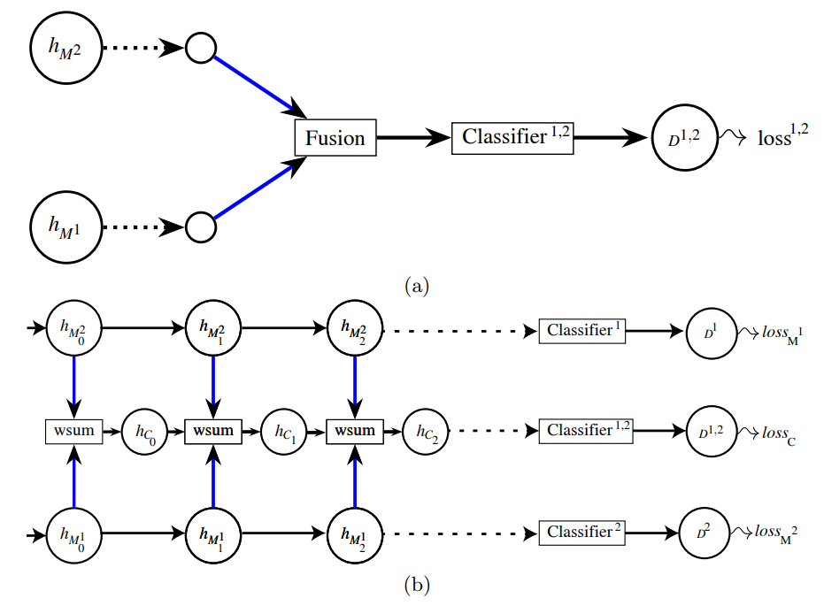

## 3.CMFNet模块

### 论文：Compound Multi-branch Feature Fusion for Real Image Restoration [arxiv.org](https://arxiv.org/pdf/2206.02748v1)

> 模块简介：本文介绍了一种基于深度学习的图像恢复模型CMFNet，它通过复合多分支特征融合实现去模糊、去雾、去雨水等功能，适用于监控视频和医学图像处理。CMFNet的模型架构包括U-Net结构、注意力模块和监督注意模块，展示了在不同恢复任务中的优秀效果。

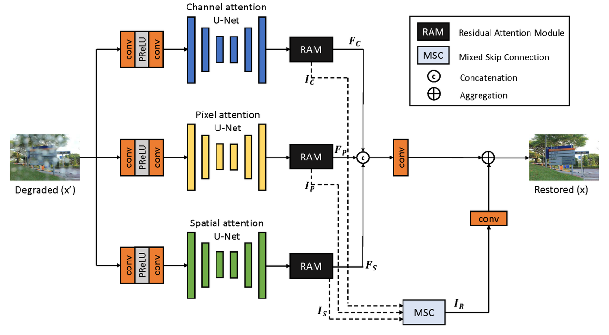

## 4.AFFAR模块

### 论文：Domain Generalization for Activity Recognition via Adaptive Feature Fusion [arxiv.org](https://arxiv.org/pdf/2207.11221v1)

> 模块简介：作者提出了一项新的挑战：域泛化活动识别（domain-generalized activity recognition, DGAR），并提出了 AFFAR（Adaptive Feature Fusion for Activity Recognition）的方法，AFFAR 融合了域不变和域特定的特征以提高模型的泛化性能，域不变的特征具备良好的迁移性能，而域特定的特征能提高各个域的分类性能。

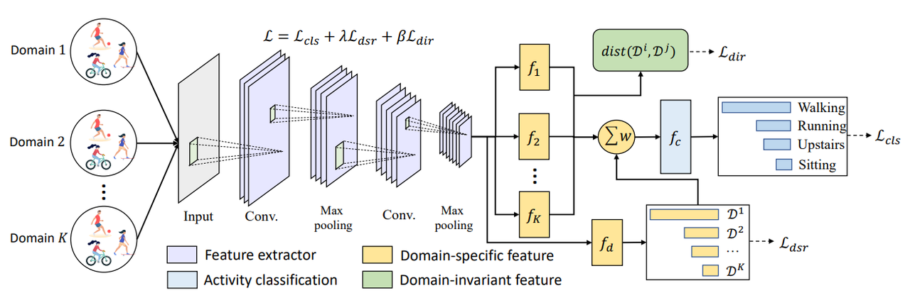

## 5.DSSD模块

### 论文：DSSD : Deconvolutional Single Shot Detector [arxiv.org](https://arxiv.org/pdf/1701.06659v1)

> 模块简介：DSSD的网络结构与SSD对比如下图所示，以输入图像尺寸为为例，图中的上半部分为SSD-resnet101的网络结构，conv3\_x层和conv5\_x层为原来的resnet101中的卷积层，后面的五层是SSD扩展卷积层，原来的SSD算法是将这七层的特征图直接输入到预测阶段做框的回归任务和分类任务。DSSD是将这七层特征图拿出六层（去掉尺寸为的特征图）输入到反卷积模型里，输出修正的特征图金字塔，形成一个由特征图组成的沙漏结构。最后经预测模块输入给框回归任务和分类任务做预测。

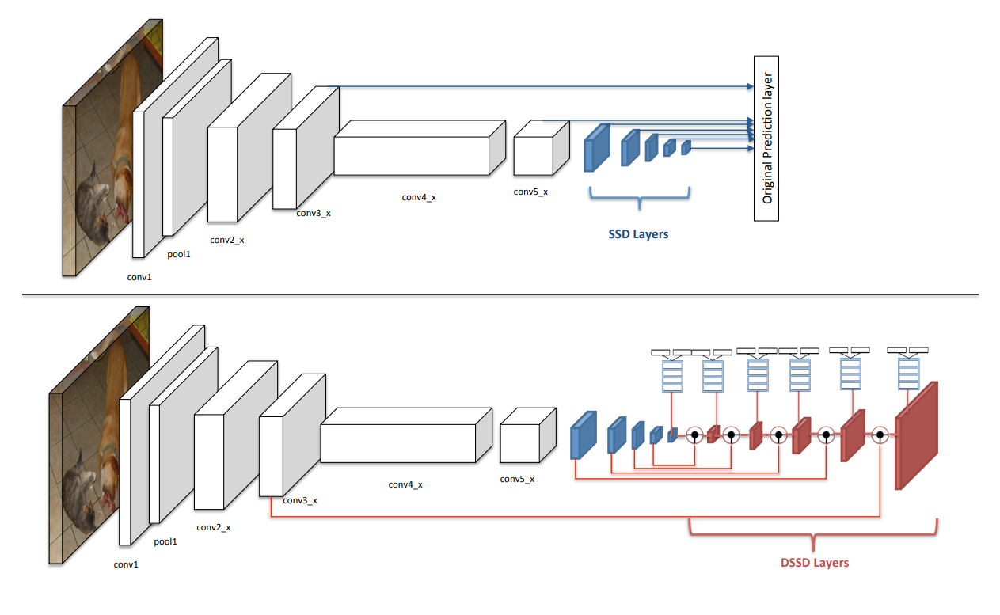

## 6.Low-rank-Multimodal-Fusion模块

### 论文：Efficient Low-rank Multimodal Fusion with Modality-Specific Factors [arxiv.org](https://arxiv.org/pdf/1806.00064v1)

> 模块简介：为了解决基于张量的多模态融合方法计算效率差的问题，文章提出了一种低秩多模态融合的方法(Low-rank Multimodal Fusion, LMF)的方法。通过将张量和权重并行分解，利用模态特定的低阶因子来执行多模态融合。避免计算高维的张量，降低了内存开销，将指数级的时间复杂度降低到了线性。

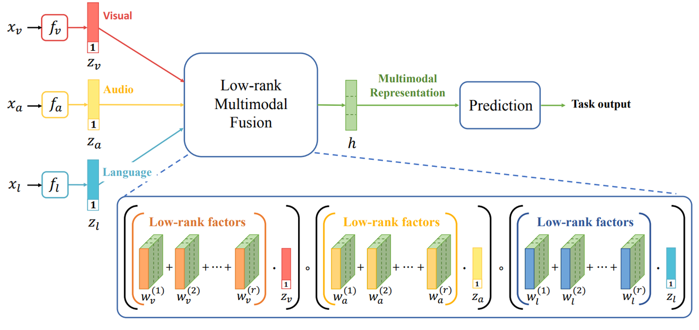

## 7.FPN模块

### 论文：Feature Pyramid Networks for Object Detection [arxiv.org](https://arxiv.org/pdf/1612.03144v2)

> 模块简介：作者提出的FPN（Feature Pyramid Network）算法同时利用低层特征高分辨率和高层特征的高语义信息，通过融合这些不同层的特征达到预测的效果。并且预测是在每个融合后的特征层上单独进行的，这和常规的特征融合方式不同。

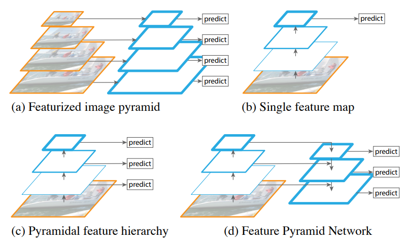

## 8.FSSD模块

### 论文：FSSD: Feature Fusion Single Shot Multibox Detector [arxiv.org](https://arxiv.org/pdf/1712.00960v4)

> 模块简介：本文提出特征融合FSSD，这是一种改进的特征融合算法，采用了一种新型的、轻量级的特征融合模块，可以在速度稍有下降的情况下显著提高SSD的性能。特征融合模块，将不同层的不同尺度的特征拼接在一起，然后通过一些下采样块生成新的特征金字塔，并将新特征金字塔反馈给多盒检测器，预测最终的检测结果。

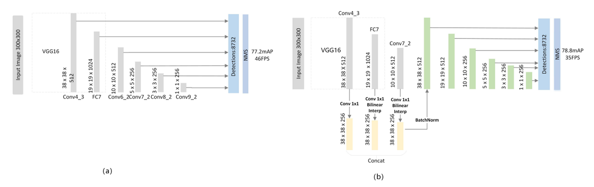

## 9.CLAP模块

### 论文：Large-scale Contrastive Language-Audio Pretraining with Feature Fusion and Keyword-to-Caption Augmentation [arxiv.org](https://arxiv.org/pdf/2211.06687v4)

> 模块简介：本文提出了一种对比语言-音频预训练管道，通过结合音频数据和自然语言描述来开发音频表示

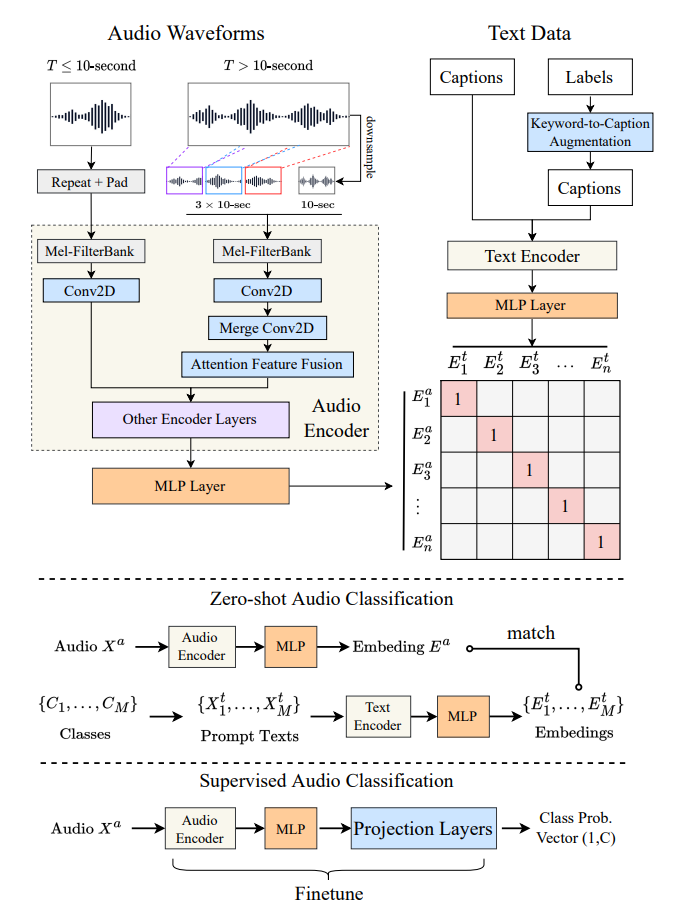

## 10.ASSF模块

### 论文：Learning Spatial Fusion for Single-Shot Object Detection [arxiv.org](https://arxiv.org/pdf/1911.09516v2)

> 模块简介：本文提出自适应空间特征融合（ASFF）策略，解决基于特征金字塔的单阶段检测器中不同尺度特征不一致的问题。ASFF通过学习融合权重，增强尺度不变性，提高检测性能。在YOLOv3基线上实现性能提升，特别是在MS COCO数据集上的速度与精度平衡。

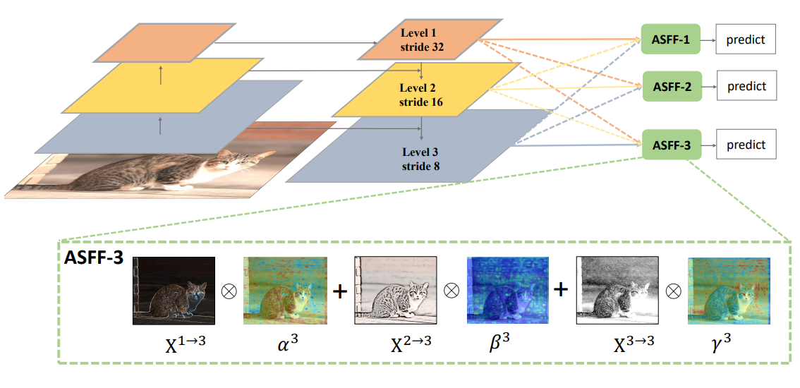

## 11.Multimodal Topic Learning for Video Recommendation

### 论文：Multimodal Topic Learning for Video Recommendation [arxiv.org](https://arxiv.org/pdf/2010.13373v1)

> 模块简介：模型架构上半部分是普通推荐架构。使用视频的封面图和标题在经典多任务模型的MMoE架构下做优化。下半部分是topic生成。左边是构建标签图找标签之间的关系得到表示，然后使用视频的相应tag和封面，标题信息一起构成视频特征，然后用k-means做聚类生成topic

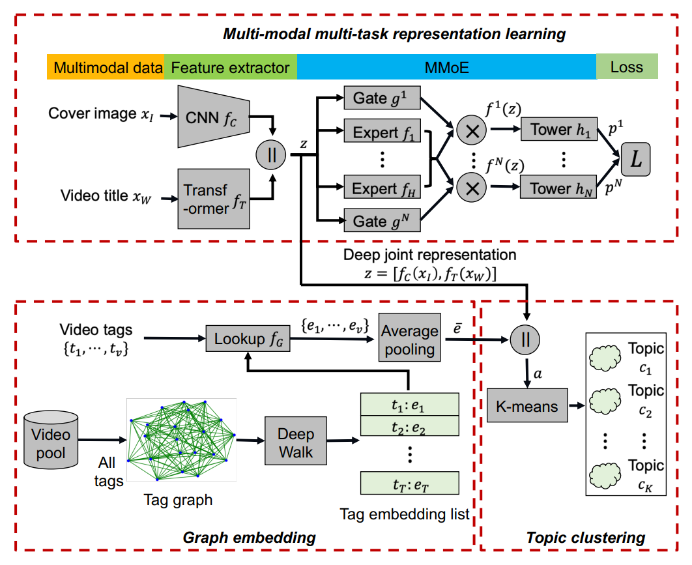

## 12.Rethinking Atrous Convolution for Semantic Image Segmentation

### 论文：Rethinking Atrous Convolution for Semantic Image Segmentation [arxiv.org](https://arxiv.org/pdf/1706.05587v3)

> 模块简介：DeepLab系列在分割领域一直很受欢迎，知名度很高。单看DeepLabV3，其实真正的创新点没有前两篇丰富，没有增加新的模块，而是针对于前两个版本做了一下升华和总结。在文中作者也说了，为什么能在不加DenseCRF后处理的情况下超越前几个版本的性能，两点：1）Batch Normalization的引入；2）ASPP模块的探索，加入了image-level的特征。其实，我觉得本文主要的亮点在于对Atrous Convolution并行/串行两种应用方式的探索。从这个系列来看，DeepLabV1、V2工作很novelty，并且能达到不错的performance；V3其实在前面的工作上增加了一些小的点（batch normalization 和 Image-level feature），但很work。虽然novelty的工作很少，但是奈何performance牛逼啊，然后写作上注重消融实验。学术创新不易啊~

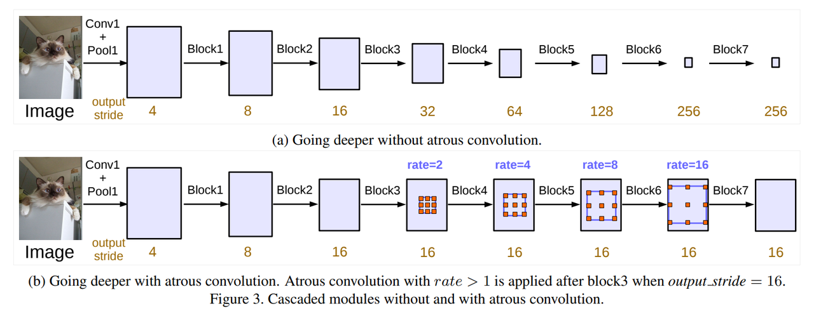

> :book: [机制详解](dl-modules/modules/fusion/rethinking_atrous_convolution_for_semantic_image_segmentation/detailed.md)
> :computer: [Python代码](dl-modules/modules/fusion/rethinking_atrous_convolution_for_semantic_image_segmentation/module.py)

## 13.TFN模块

### 论文：Tensor Fusion Network for Multimodal Sentiment Analysis [arxiv.org](https://arxiv.org/pdf/1707.07250v1)

> 模块简介：作者提出了一种新的模型Tensor Fusion Network（张量融合网络，TFN），TFN能够端到端地学习模态内和模态间的动态，采用一种新的多模态融合方法（张量融合）对模态间动态进行建模，模态内动态则通过三个模态嵌入子网络进行建模。

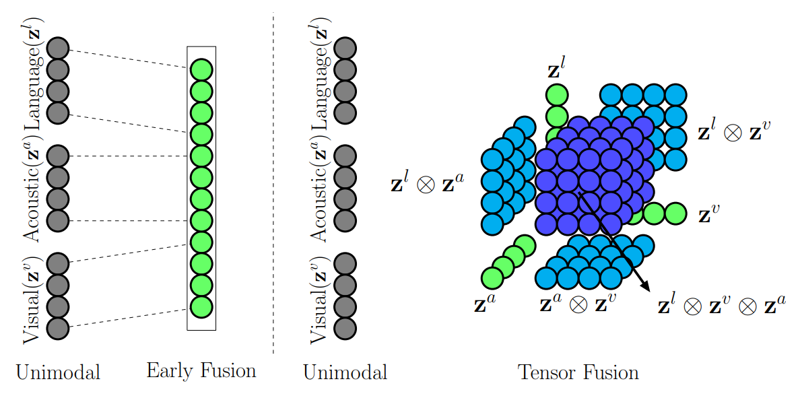

# 五、下采样系列模块

## 1.AutoFocusFormer模块

### 论文：AutoFocusFormer: Image Segmentation off the Grid [arxiv.org](https://arxiv.org/pdf/2304.12406v2)

> 模块简介：本文提出一种局部注意力 Transformer 图像识别 Backbone，即 AutoFocusFormer (AFF) 方法，执行自适应下采样来学习保留最重要的像素信息。由于自适应下采样会产生一些不规则的像素分布，因此放弃了经典的grid结构，而提出了一种新的基于点的局部注意力 block，由一个平衡聚类模块和一个可学习的聚类融合模块组成。实验表明 AFF 的性能很棒。

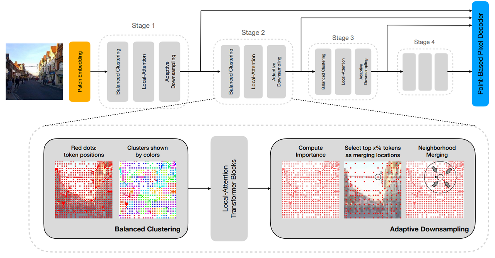

## 2.CM-DM模块

### 论文：Correlated and Multi-frequency Diffusion Modeling for Highly Under-sampled MRI Reconstruction [arxiv.org](https://arxiv.org/pdf/2309.00853v1)

> 模块简介：在本研究中，利用k-空间数据和扩散过程的组合特性，我们的新方案侧重于挖掘不同策略的多频率先验，以在重建图像中保留精细的纹理细节。此外，如果其目标分布与噪声分布紧密相似，则扩散过程可以更快地收敛。这可以通过名种高频先验提取器来实现。这一发现进一步证实了基干分数的生成模型的有效性。在所有优点之上，我们的方法提高了MR!重建的准确性和加速了采样过程。实验结果验证了所提出的方法成功地获得了更准确的重建，并优于最先进的方法。

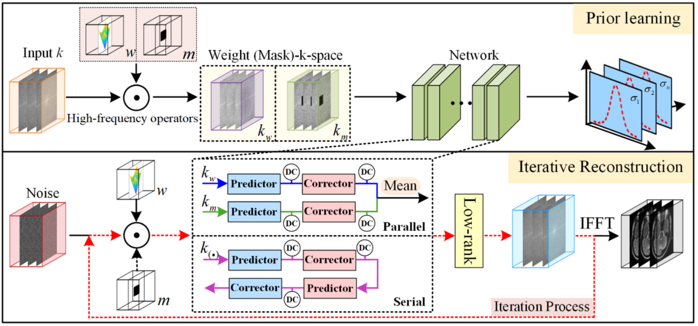

## 3.FastICENet模块

### 论文：FastICENet: A real-time and accurate semantic segmentation model for aerial remote sensing river ice image FouriDown[www.sciencedirect.com](https://www.sciencedirect.com/science/article/abs/pii/S0165168423002244)

> 模块简介：本文提出了一种实时、准确的河冰语义分割网络，命名为FastICENet。 总体架构由两个分支组成，即浅层高分辨率空间分支和深层上下文语义分支，针对遥感图像中河冰的尺度多样性和不规则形状进行了精心设计。 然后，在上下文分支中采用新颖的下采样模块和基于轻量级Ghost模块的密集连接块来降低计算成本。 此外，采用可学习的上采样策略DUpsampling来代替常用的双线性插值，以提高分割精度。

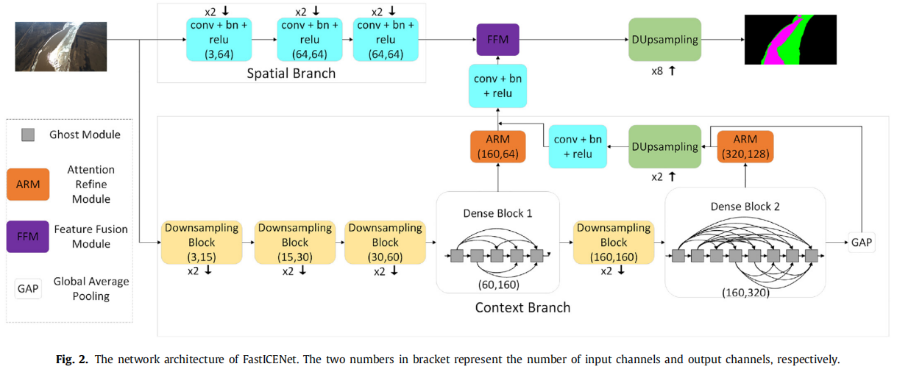

## 4.FouriDown模块

### 论文：FouriDown: Factoring Down-Sampling into Shuffling and Superposing [openreview.net](https://openreview.net/pdf?id=nCwStXFDQu)

> 模块地址：在本研究中，我们深入探讨了空间下采样族的工作机制，并分析了现有下采样方法中静态加权策略所导致的偏差效应。为解决偏差问题，我们提出了一种名为FouriDown的新型下采样范式，该范式在傅里叶域中操作，并根据图像上下文自适应地进行特征采样

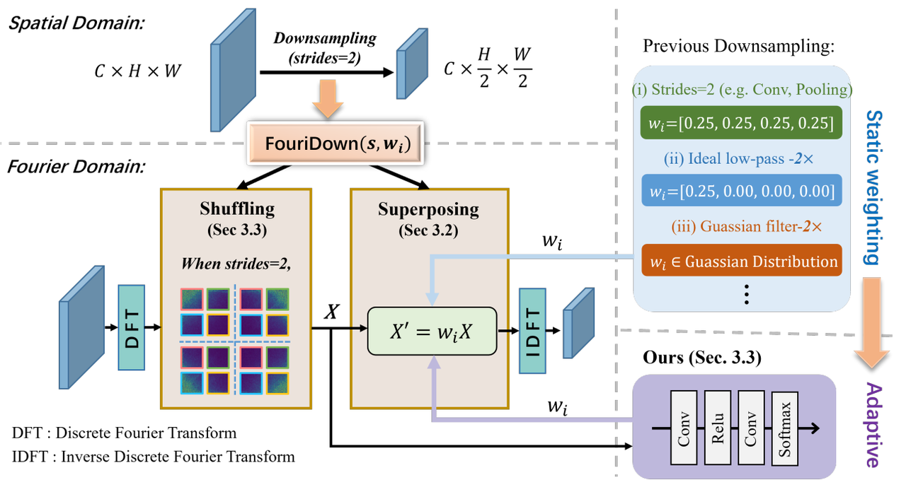

## 5.GC ViT模块

### 论文：Global Context Vision Transformers [arxiv.org](https://arxiv.org/pdf/2206.09959v5)

> 模块简介：作者提出了全局上下文Vision Transformer(GCViT)，这是一种提高参数和计算利用率的新架构。提出的方法利用全局上下文自注意模块，与局部自注意相结合，有效地建模长期和短期空间交互，而不需要昂贵的操作。

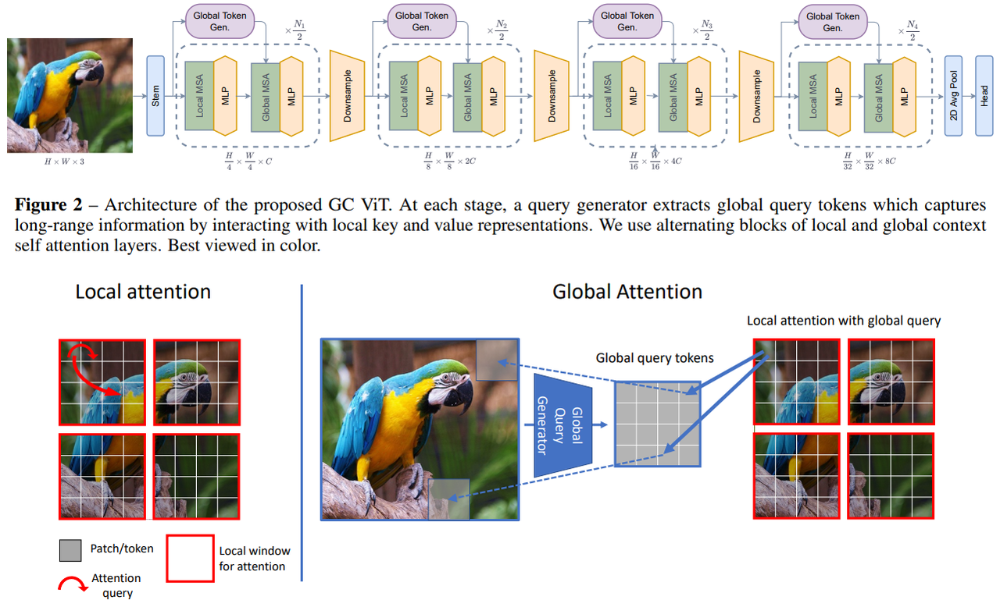

## 6.LUM-ViT模块

### 论文：LUM-ViT: Learnable Under-sampling Mask Vision Transformer for Bandwidth Limited Optical Signal Acquisition [arxiv.org](https://arxiv.org/pdf/2403.01412v1)

> 模块简介：信号采集过程中的带宽限制经常阻碍实时检测应用。高光谱数据是一个显著的例子，其庞大的体积影响了实时的高光谱检测。为了解决这一障碍，我们引入了一种新方法，利用购置前调制来减少购置量。该调制过程由深度学习模型控制，利用了先验信息。我们的方法的核心是LUM-ViT，一种Vision Transformer变体。独特的是，LUM-iT采用了可学习的取样不足掩模，专门用于采集前调制。为了进一步优化光学计算，我们提出了一种核级权重二值化技术和一种三阶段微调策略。我们的评估表明，通过仅对10% 的原始图像像素进行采样，LUM-ViT 将\[mageNet分类任务的精度损失保持在 1.8% 以内。当在现实世界的光学硬件上实施时，该方法保持了接近原始的准确性，证明了它的实用性

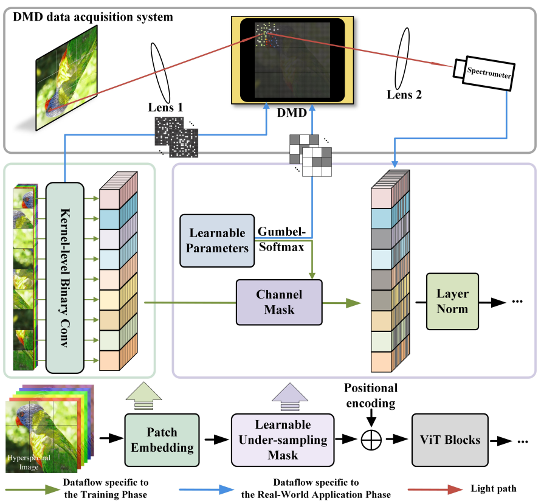

## 7.SPD-Conv模块

### 论文：No More Strided Convolutions or Pooling: A New CNN Building Block for Low-Resolution Images and Small Objects [arxiv.org](https://arxiv.org/pdf/2208.03641v1)

> 模块简介：提出了一个新的构建模块，称为SPD-Conv，完全替代(从而消除)卷积步长和池化层。SPD- conv是一个空间到深度(SPD)层，后面跟着一个无步长卷积层。SPD层对特征映射X进行下采样，但保留了通道维度中的所有信息，因此没有信息丢失。我们受到了图像转换技术\[29\]的启发，该技术在将原始图像输入神经网络之前将其缩放，但我们基本上将其推广到整个网络内部和整个网络中的下采样特征映射;此外，我们在每个SPD之后添加了一个无步长卷积操作，以在增加的卷积层中使用可学习参数减少(增加的)通道数量

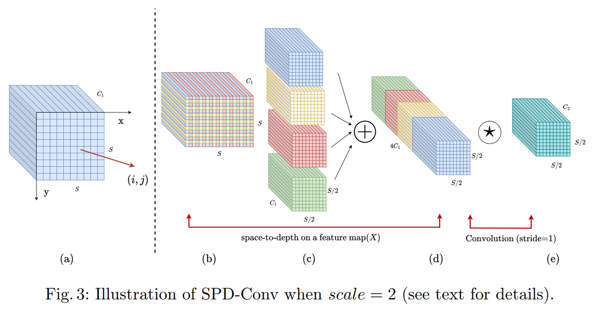

## 8.PUERT模块

### 论文：PUERT: Probabilistic Under-sampling and Explicable Reconstruction Network for CS-MRI [arxiv.org](https://arxiv.org/pdf/2204.11189v1)

> 模块简介：提出了一种新颖的端到端概率欠采样和可解释重建网络称为PUERT，以共同优化采样模式和重建网络。与学习确定性掩码不同，所提出的采样子网探索了一种最优的概率子采样模式，该模式描述了每个可能采样点的独立伯努利随机变量，从而保留了鲁棒性和随机性，以实现更可靠的CS重建。 进一步引入了一种动态梯度估计策略，用于在反向传播中逐渐逼近二值化函数，这有效地保留了梯度信息，并进一步提高重建质量

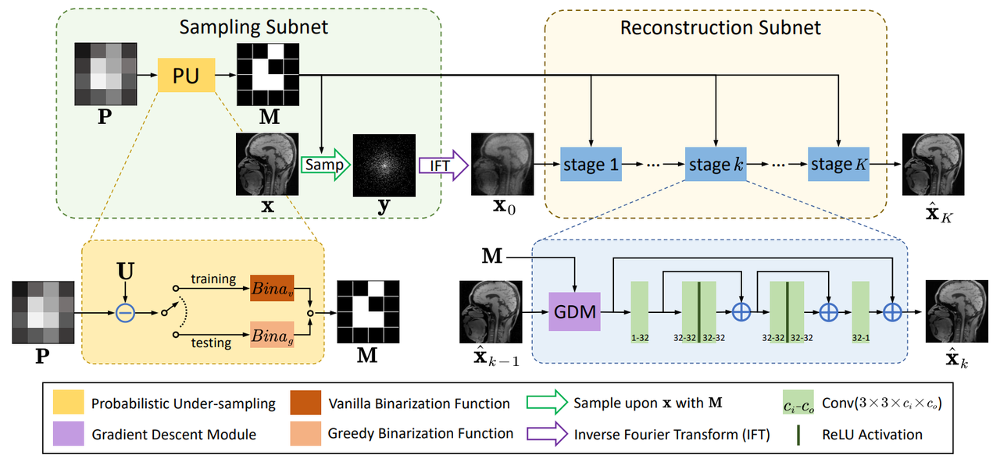

# 六、注意力系列模块

## 1.A2 -Nets模块

### 论文：A2 -Nets: Double Attention Networks [arxiv.org](https://arxiv.org/pdf/1810.11579)

> 模块简介：提出了“双重注意力块”，这是一个新颖的组件，它从输入图像/视频的整个时空空间聚合和传播有用的全局特征，使后续的卷积层能够高效地访问整个空间的特征。该组件设计了两个步骤的双重注意力机制，第一步通过二阶注意力池化将整个空间的特征聚集到一个紧凑集，第二步通过另一个注意力自适应地选择和分配特征到每个位置。提出的双重注意力块易于采用，可以方便地插入现有的深度神经网络中

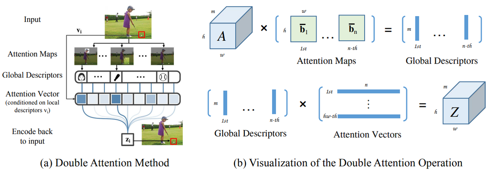

> :book: [机制详解](dl-modules/modules/attention/a2_nets/detailed.md)
> :computer: [Python代码](dl-modules/modules/attention/a2_nets/module.py)

## 2.HAT模块

### 论文：Activating More Pixels in Image Super-Resolution Transformer [arxiv.org](https://arxiv.org/pdf/2205.04437v3)

> 模块简介：本文提出了一种混合注意力Transformer，即 HAT。HAT结合了通道注意力和自注意力机制，以利用前者获取全局信息的能力和后者强大的表征能力。此外，引入重叠交叉注意力模块，以实现相邻窗口特征更直接的交互，受益于这些设计，模块可以激活更多的像素重建，从而获得更显著的性能提升。

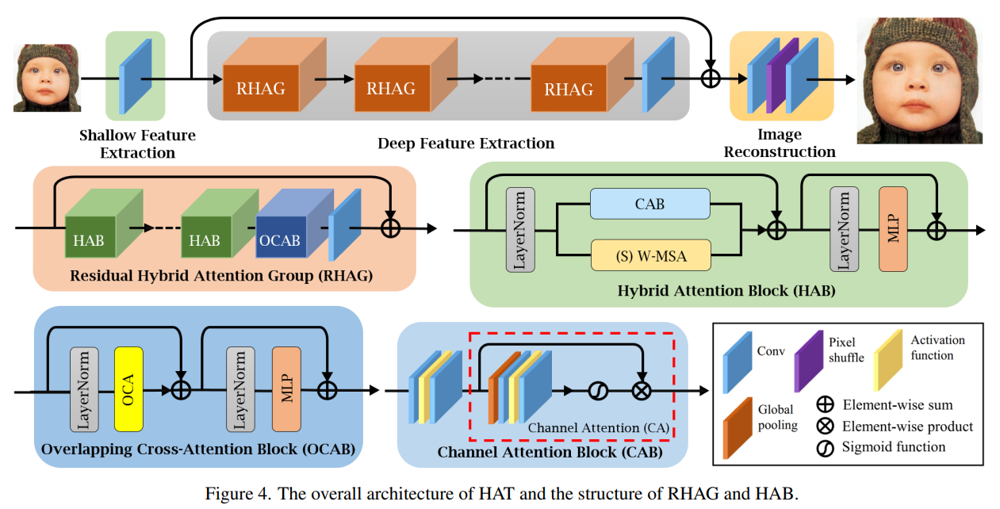

## 3.Agent Attention模块

### 论文：Agent Attention: On the Integration of Softmax and Linear Attention [arxiv.org](https://arxiv.org/pdf/2312.08874v3)

> 模块简介：本文提出一种新型Transformer模型，它结合了Linear Attention和Softmax Attention的优点，在计算效率和表示能力之间取得良好的平衡。具体来说，Agent Attention，表示为四元组，在传统的Attention模块中引入了一组额外的Agent token A。Agent token首先作为Query token Q的代理，从K和V中聚合信息，然后将信息广播回Q。代理令牌的数量可以设计得比查询令牌的数量小得多，从而减少了时间复杂度。本文证明了所提出的代理注意等同于线性注意的广义形式。

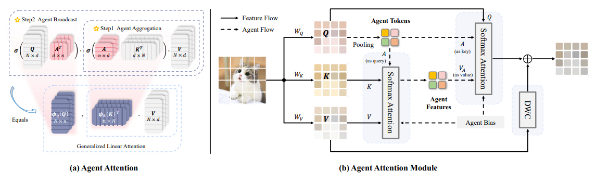

## 4.TCN模块

### 论文：An Empirical Evaluation of Generic Convolutional and Recurrent Networks for Sequence Modeling [arxiv.org](https://arxiv.org/pdf/1803.01271v2)

> 模块简介：对于大多数深度学习从业者来说，序列建模是重复网络的代名词。然而，最近的研究结果表明，卷积架构可以优于经常性网络的任务，如音频合成和机器翻译。给定一个新的序列建模任务或数据集，应该使用哪种架构?我们对用于序列建模的通用卷积和递归体系结构进行了系统评估。这些模型在广泛的标准任务中进行评估，这些任务通常用于对经常性网络进行基准测试。 我们的结果表明，简单的卷积架构在各种任务和数据集上优于经典的循环神经网络，如LSTMS，同时表现出更长的有效记忆。我们得出结论，序列建模和循环网络之间的常见联系应该重新考虑，卷积网络应该被视为序列建模任务的自然起点

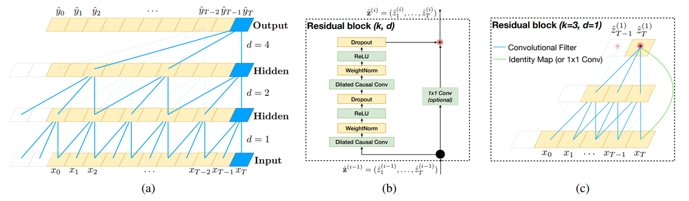

## 5.BiFormer模块

### 论文：BiFormer: Vision Transformer with Bi-Level Routing Attention [arxiv.org](https://arxiv.org/pdf/2303.08810v1)

> 模块简介：通过双层路由(bi-level routing)提出了一种新颖的动态稀疏注意力(dynamic sparse attention)，以实现更灵活的计算分配和内容感知，使其具备动态的、query感知的稀疏性
> 
> 使用两级路由注意力作为基本构建块，提出了一个新的视觉Transformer，名为BiFormer，视觉领域的多个实验表明该模型具有更好的性能。

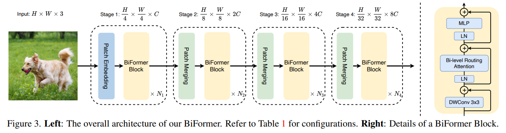

> :book: [机制详解](dl-modules/modules/attention/biformer/detailed.md)
> :computer: [Python代码](dl-modules/modules/attention/biformer/module.py)

## 6.CBAM模块

### 论文：CBAM: Convolutional Block Attention Module [arxiv.org](https://arxiv.org/pdf/1807.06521v2)

> 模块简介：CBAM（Convolutional Block Attention Module）是一种卷积神经网络模块，旨在通过引入注意力机制来提升网络的表示能力。CBAM包含两个顺序子模块：通道注意力模块和空间注意力模块。

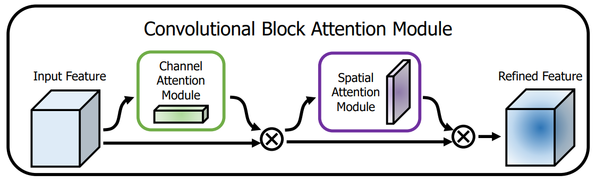

> :book: [机制详解](dl-modules/modules/attention/cbam/detailed.md)
> :computer: [Python代码](dl-modules/modules/attention/cbam/module.py)

## 7.CenterMask模块

### 论文：CenterMask : Real-Time Anchor-Free Instance Segmentation [arxiv.org](https://arxiv.org/pdf/1911.06667v6)

> 模块简介：CenterMask 是一款创新的实时无锚框实例分割模型，它基于 FCOS（Fully Convolutional One-Stage Object Detection）对象检测器，并引入了全新的空间注意力引导掩码（Spatial Attention-Guided Mask, SAG-Mask）分支。这一设计不仅提升了实例分割的精度，还显著提高了处理速度，使其在实时应用中表现出色。

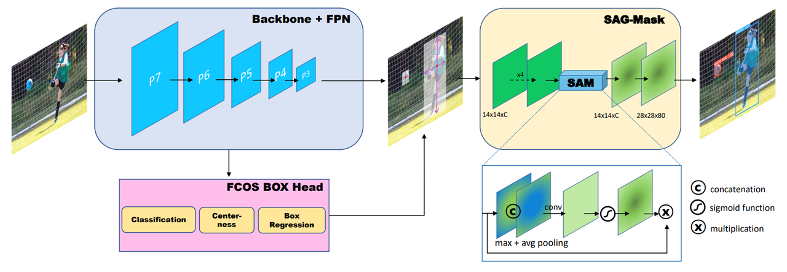

## 8.ECA-Net模块

### 论文：ECA-Net: Efficient Channel Attention for Deep Convolutional Neural Networks [arxiv.org](https://arxiv.org/pdf/1910.03151v4)

### 代码链接：

> 模块简介：本篇论文作者提出了一种有效的通道注意力(ECA)模块，该模块通过快速的一维卷积产生通道注意，其核大小可以通过通道维数的非线性映射自适应地确定。实验结果表明，我们的ECA是一个非常轻量级的即插即用块，可以提高各种深度CNN架构的性能，包括广泛使用的ResNets和轻量级的MobileNetV2。此外，我们的ECA-Net在目标检测和实例分割任务中表现出良好的泛化能力。

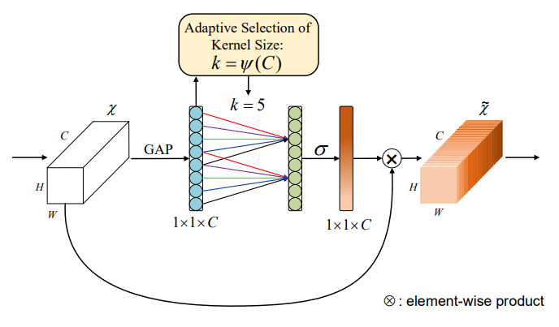

> :book: [机制详解](dl-modules/modules/attention/eca/detailed.md)
> :computer: [Python代码](dl-modules/modules/attention/eca/module.py)

## 9.EMA-attention-module模块

### 论文：Efficient Multi-Scale Attention Module with Cross-Spatial Learning [arxiv.org](https://arxiv.org/pdf/2305.13563v2)

> 模块简介：EMA不仅通过类似CA的处理避免了维度减缩，还通过3x3卷积在更大尺度上捕获特征，并通过跨空间学习方法聚合多个并行子网络的输出特征图。相比其他注意力机制（如CBAM、NAM、SA、ECA和CA），EMA不仅取得了更好的结果，而且在参数要求方面更为高效。

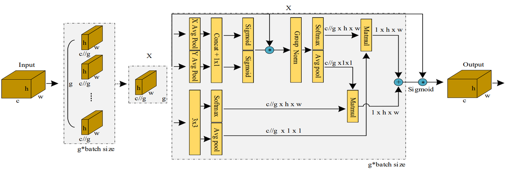

> :book: [机制详解](dl-modules/modules/attention/ema_attention_module/detailed.md)
> :computer: [Python代码](dl-modules/modules/attention/ema_attention_module/module.py)

## 10.FECAM模块

### 论文：FECAM: Frequency Enhanced Channel Attention Mechanism for Time Series Forecasting [arxiv.org](https://arxiv.org/pdf/2212.01209v1)

> 模块简介：这篇文章提出的频率增强通道注意力机制（FECAM）是一种基于离散余弦变换（DCT）的方法，用于解决时间序列预测中的高频噪声问题。传统的傅里叶变换虽然能够提取数据中的频率信息，但容易因为Gibbs现象引入不必要的高频噪声，导致预测结果的偏差。通过使用DCT，FECAM能够更好地捕捉和建模通道间的频率依赖性，从而提升模型的预测精度和泛化能力。

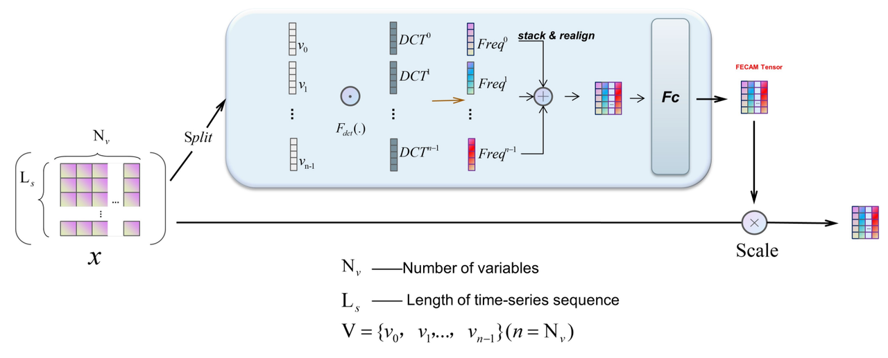

## 11.Gather-Excite模块

### 论文：Gather-Excite: Exploiting Feature Context in Convolutional Neural Networks [arxiv.org](https://arxiv.org/pdf/1810.12348v3)

> 模块简介：考虑了如何有效利用CNN中的特征上下文的问题。我们提出了聚集激发（GE）框架来解决此问题，并提供实验证据证明该方法在多个数据集和模型体系结构中的有效性。在未来的工作中，我们计划调查聚集激励运算符是否可能在其他计算机视觉任务（例如语义分割）中被证明有用，我们期望这些也可以从特征上下文的有效使用中受益

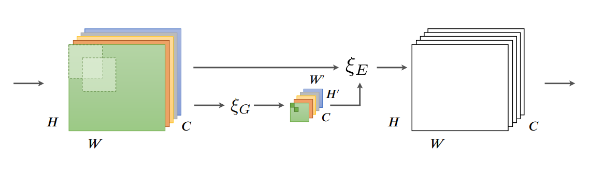

## 12.GCNet模块

### 论文：Global Context Networks [arxiv.org](https://arxiv.org/pdf/2012.13375v1)

> 模块简介：GCNet通过观察发现Non-localBlock计算的全局上下文对查询位置不敏感，提出了更高效的全局上下文模块，结合SEBlock，减少了计算量而不牺牲性能。GCBlock在多个视觉任务上优于NLNet和SENet。

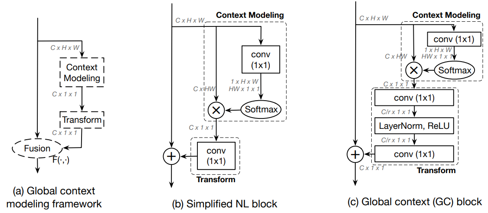

## 13.LSKNet模块

### 论文：Large Selective Kernel Network for Remote Sensing Object Detection [arxiv.org](https://arxiv.org/pdf/2303.09030v2)

> 模块简介：作者提出了一种新的遥感影像目标识别方法，即Large Selective Kernel Network (LSKNet)。该方法通过在特征提取模块动态调整感受野，更有效地处理了不同目标所需的背景信息差异。其中，动态感受野由一个空间选择机制实现，该机制对一大串Depth-wise 卷积核所处理的特征进行有效加权和空间融合。这些卷积核的权重根据输入动态确定，同时允许模型针对空间上的不同目标自适应地选择不同大小的核并调整感受野

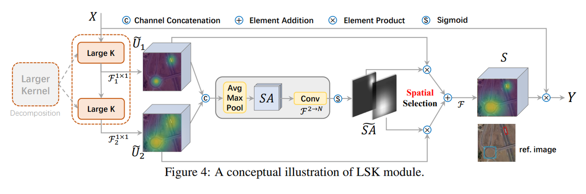

## 14.Non-local Neural Networks模块

### 论文：Non-local Neural Networks [arxiv.org](https://arxiv.org/pdf/1711.07971v3)

> 模块简介：这篇文章非常重要，个人认为应该算是cv领域里面的自注意力机制的核心文章，语义分割里面引入的各种自注意力机制其实都可以认为是本文的特殊化例子。分析本文的意义不仅仅是熟悉本文，而是了解其泛化思想。

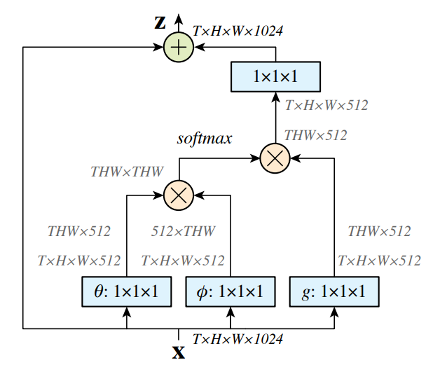

## 15.Non-stationary Transformers模块

### 论文：Non-stationary Transformers: Exploring the Stationarity in Time Series Forecasting [arxiv.org](https://arxiv.org/pdf/2205.14415v4)

> 模块简介：本文揭示了非平稳时间序列在预测中的价值，指出现有方法过度平稳化导致的预测能力下降问题。为此，提出了Non-stationary Transformers框架，包括序列平稳化和逆平稳化模块，能够在六项基准上超越主流Transformer模型。

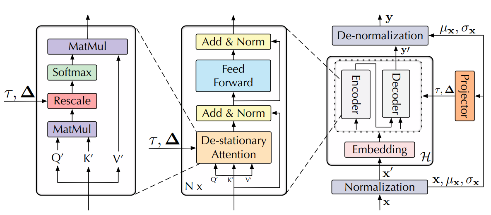

## 16.ACmix模块

### 论文：On the Integration of Self-Attention and Convolution [arxiv.org](https://arxiv.org/pdf/2111.14556v2)

> 模块简介：卷积和自注意力是两种强大的表示学习技术，它们通常被认为是两种相互独立的方法。本文表明，它们之间存在很强的内在联系，即这两种范式的大部分计算实际上是通过相同的操作完成的。具体来说，我们首先表明，具有核大小kxk的传统卷积可以分解为 k^2 个单独的 1x1 卷积，然后进行移位和求和操作。然后，我们将查询、键和值的投影在自注意力模块中解释为多个1x1卷积，然后计算注意力权重并聚合值。因此，两个模块的第一阶段都包含类似的操作。更重要的是，与第二阶段相比，第一阶段贡献了主导的计算复杂性(通道大小的平方)。这-观察自然地导致了这两个看似不同的范式的优雅整合，即混合模型，它既受益于自注意力和卷积(ACmix)，同时又具有与纯卷积或自注意力模型相比的最低计算开销。广泛的实验表明，我们的模型在图像识别和下游任务上始终优于竞争基线。

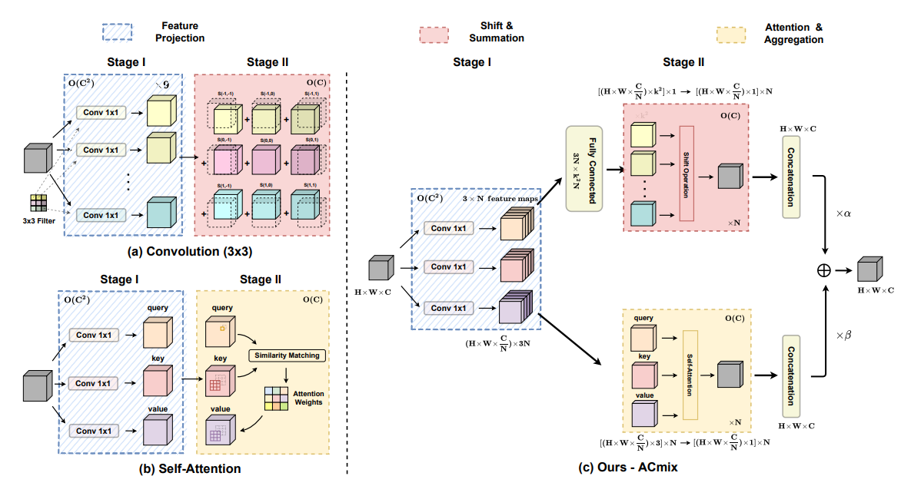

> :book: [机制详解](dl-modules/modules/attention/acmix/detailed.md)
> :computer: [Python代码](dl-modules/modules/attention/acmix/module.py)

## 17.PSA模块

### 论文：Polarized Self-Attention: Towards High-quality Pixel-wise Regression [arxiv.org](https://arxiv.org/pdf/2107.00782v2)

> 模块简介：作者提出了一个即插即用的模块——极化自注意力机制（ Polarized Self-Attention(PSA)），用于解决像素级的回归任务，相比于其他注意力机制，极化自注意力机制主要有两个设计上的亮点：
> 
> 1）极化滤波（ Polarized filtering）：在通道和空间维度保持比较高的resolution（在通道上保持C/2的维度，在空间上保持\[H,W\]的维度 ），这一步能够减少降维度造成的信息损失；
> 
> 2）增强（Enhancement）：采用细粒度回归输出分布的非线性函数。

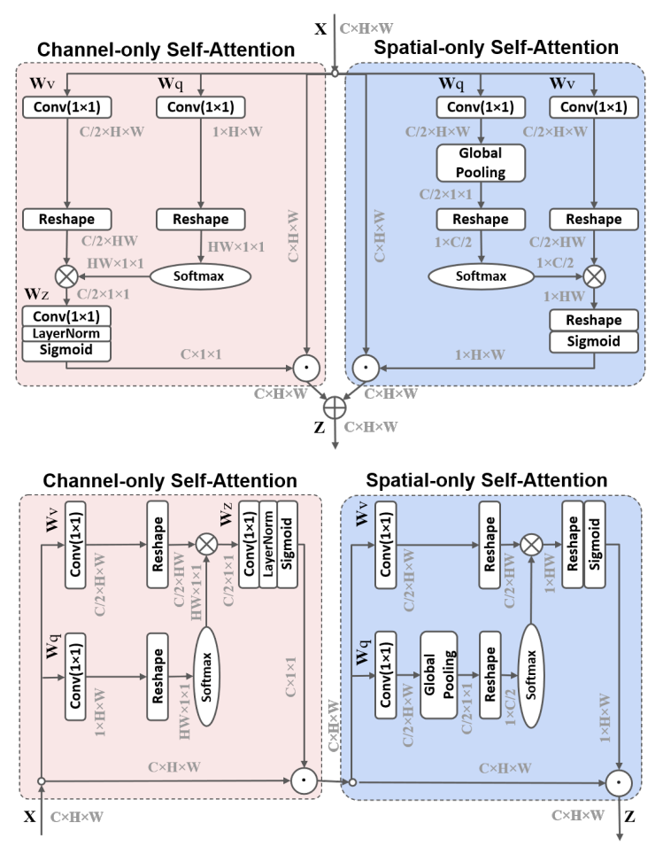

## 18.RevCol模块

### 论文：Reversible Column Networks [arxiv.org](https://arxiv.org/pdf/2212.11696v3)

> 模块简介：提出以 reversible column 为单元来传递信息，既保证特征解耦，同时信息在网络中的传递不受到损失。整个网络结构包括了多个子网络（我们称为 column），column 间加入可逆的连接，通过将输入反复接入 column，逐渐分离 low-level 的纹理细节和 semantic 语义信息

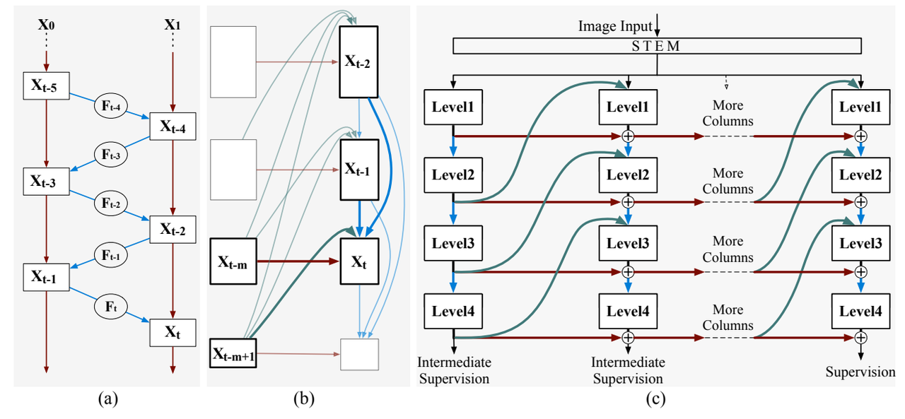

> ──────────────────────────────
> 以下 28 个模块来自详解文件，补充机制讲解与代码实现：

## 19.AFT

### 论文：[An Attention Free Transformer](https://arxiv.org/abs/2105.14103)

> 模块简介：注意力自由变换器（AFT）旨在通过去除传统Transformer中的点积自注意力机制，提供一种更高效的变换器模型。它特别适用于需要高计算效率和较低内存消耗的应用场景，如移动设备和边缘计算。

> :book: [机制详解](dl-modules/modules/attention/aft/detailed.md)
> :computer: [Python代码](dl-modules/modules/attention/aft/module.py)

## 20.Axial_attention

### 论文：[AXIAL ATTENTION IN MULTIDIMENSIONAL TRANSFORMERS](https://arxiv.org/abs/1912.12180)

> 模块简介：Axial Attention 提出了一种用于图像和其他作为高维张量组织的数据的自注意力基的自回归模型。传统的自回归模型要么因高维数据而导致计算资源需求过大，要么为了减少资源需求而在分布表达性或实现简便性方面做出妥协。Axial Transformers 设计旨在在保持数据上联合分布的完整表达性和易于使用标准深度学习框架实现的同时，要求合理的内存和计算资源，并在标准生成建模基准上实现最先进的结果。

> :book: [机制详解](dl-modules/modules/attention/axial_attention/detailed.md)
> :computer: [Python代码](dl-modules/modules/attention/axial_attention/module.py)

## 21.Cloattention

### 论文：[Rethinking Local Perception in Lightweight Vision Transformer](https://arxiv.org/abs/2303.17803)

> 模块简介：CloFormer（Context-aware Local Enhancement Vision Transformer）是一种轻量级的视觉Transformer，用于在保持模型轻量化的同时，提高在各种视觉任务中的性能，包括图像分类、目标检测和语义分割。其主要目的是提升移动设备上的视觉模型性能，克服直接缩减标准ViT（VisionTransformer）模型尺寸导致的性能下降问题。

> :book: [机制详解](dl-modules/modules/attention/cloattention/detailed.md)
> :computer: [Python代码](dl-modules/modules/attention/cloattention/module.py)

## 22.CoordAttention

### 论文：[Coordinate Attention for Efficient Mobile Network Design](https://arxiv.org/abs/2103.02907)

> 模块简介：Coordinate Attention提出了一种新的注意力机制，用于在移动网络中嵌入位置信息到通道注意力中。这种方法不仅关注“哪些通道是重要的”，而且关注“在哪里”关注，通过更精细地控制空间选择性注意力图的生成，进一步提升模型性能。

> :book: [机制详解](dl-modules/modules/attention/coordattention/detailed.md)
> :computer: [Python代码](dl-modules/modules/attention/coordattention/module.py)

## 23.CoTAttention

### 论文：[Contextual Transformer Networks for Visual Recognition](https://arxiv.org/abs/2107.12292)

> 模块简介：Contextual Transformer (CoT) block 设计为视觉识别的一种新颖的 Transformer 风格模块。该设计充分利用输入键之间的上下文信息指导动态注意力矩阵的学习，从而加强视觉表示的能力。CoT block 首先通过 3x3 卷积对输入键进行上下文编码，得到输入的静态上下文表示。然后，将编码后的键与输入查询合并，通过两个连续的 1x1 卷积学习动态多头注意力矩阵。学习到的注意力矩阵乘以输入值，实现输入的动态上下文表示。最终将静态和动态上下文表示的融合作为输出。

> :book: [机制详解](dl-modules/modules/attention/cot_attention/detailed.md)
> :computer: [Python代码](dl-modules/modules/attention/cot_attention/module.py)

## 24.CrissCrossAttention

### 论文：[CROSSFORMER: A VERSATILE VISION TRANSFORMER HINGING ON CROSS-SCALEATTENTION](https://arxiv.org/abs/2103.08483)

> 模块简介：CrossFormer通过跨尺度的特征提取和注意力机制，有效处理计算机视觉任务。它克服了现有视觉Transformer无法在不同尺度间建立有效交互的限制，提升了模型对图像的理解能力。

> :book: [机制详解](dl-modules/modules/attention/crisscrossattention/detailed.md)
> :computer: [Python代码](dl-modules/modules/attention/crisscrossattention/module.py)

## 25.DANet

### 论文：[Dual Attention Network for Scene Segmentation](https://arxiv.org/abs/1809.02983)

> 模块简介：双重注意力网络（DANet）旨在通过引入自注意力机制来捕获丰富的上下文依赖性，从而提升场景分割任务中的特征提取能力。通过在空间和通道维度上捕捉全局依赖关系，DANet能够适应性地整合局部特征及其全局依赖，显著提高像素级识别的精确度。

> :book: [机制详解](dl-modules/modules/attention/danet/detailed.md)
> :computer: [Python代码](dl-modules/modules/attention/danet/module.py)

## 26.DilateForme

### 论文：[DilateFormer: Multi-Scale Dilated Transformer for Visual Recognition](https://arxiv.org/abs/2302.01791)

> 模块简介：DilateFormer旨在通过采用多尺度膨胀注意力机制，提升视觉识别任务中的特征提取能力。这种方法通过在不同的尺度上应用膨胀卷积，捕获图像的局部和全局依赖性。

> :book: [机制详解](dl-modules/modules/attention/dilateforme/detailed.md)
> :computer: [Python代码](dl-modules/modules/attention/dilateforme/module.py)

## 27.EfficientAdditiveAttnetion

### 论文：[SwiftFormer: Efficient Additive Attention for Transformer-based Real-time Mobile VisionApplications](https://arxiv.org/abs/2303.15446)

> 模块简介：SwiftFormer通过引入高效的加性注意力机制，解决了在移动设备上实时运行视觉应用时自注意力的高计算复杂性问题。这种机制通过线性的元素级乘法替换了传统的自注意力中的二次矩阵乘法操作，显著减少了计算复杂性，使得模型能够在资源受限的移动设备上高效运行，同时保持高准确率。

> :book: [机制详解](dl-modules/modules/attention/efficientadditiveattnetion/detailed.md)
> :computer: [Python代码](dl-modules/modules/attention/efficientadditiveattnetion/module.py)

## 28.EMO

### 论文：[Rethinking Mobile Block for Efficient Attention-based Models](https://arxiv.org/abs/2301.01146)

> 模块简介：本文提出了一种有效的轻量级模型设计方法，旨在开发现代高效的轻量级模型，用于密集预测任务，同时平衡参数、FLOPs和性能。作者通过重新思考高效的Inverted Residual Block（IRB）和Transformer的有效组件，从统一的视角出发，扩展了基于CNN的IRB到基于Meta attention的模型，并抽象出了一种一次残差的Meta Mobile Block（MMB），用于轻量级模型设计。

> :book: [机制详解](dl-modules/modules/attention/emo/detailed.md)
> :computer: [Python代码](dl-modules/modules/attention/emo/module.py)

## 29.EMSA

### 论文：[ResT: An Efficient Transformer for Visual Recognition](https://arxiv.org/abs/2105.13677)

> 模块简介：ResT是一种高效的多尺度视觉Transformer，作为图像识别领域的通用骨架。与现有的Transformer方法相比，ResT在处理不同分辨率的原始图像时具有多个优点：(1) 构建了一个内存高效的多头自注意力机制，通过简单的深度卷积来压缩内存，并在保持多头注意力的多样性能力的同时，跨注意力头维度进行交互；(2) 位置编码被设计为空间注意力，更加灵活，可以处理任意大小的输入图像，而无需插值或微调；(3) 与在每个阶段开始时直接对原始图像进行分块（tokenization）不同，设计了将分块嵌入

> :book: [机制详解](dl-modules/modules/attention/emsa/detailed.md)
> :computer: [Python代码](dl-modules/modules/attention/emsa/module.py)

## 30.ExternalAttention

### 论文：[Beyond Self-attention: External Attention using Two Linear Layers for Visual Tasks](https://arxiv.org/abs/2105.02358)

> 模块简介：本文提出了一种新颖的注意力机制——外部注意力（External Attention），通过使用两个外部小型可学习的共享内存来实现。这种机制能够用两个连续的线性层和两个归一化层简单实现，并且可以方便地替换现有流行架构中的自注意力机制。外部注意力具有线性复杂度，并且隐式地考虑了所有数据样本之间的关联性，为图像分类、目标检测、语义分割、实例分割、图像生成以及点云分析等视觉任务提供了与自注意力机制相当或优于的性能，同时大幅降低了计算和内存成本。

> :book: [机制详解](dl-modules/modules/attention/externalattention/detailed.md)
> :computer: [Python代码](dl-modules/modules/attention/externalattention/module.py)

## 31.gam

### 论文：[Global Attention Mechanism: Retain Information to Enhance Channel-Spatial Interactions](https://arxiv.org/abs/2112.05561)

> 模块简介：这篇论文提出了全局注意力机制（Global Attention Mechanism, GAM），旨在通过保留通道和空间方面的信息来增强跨维度交互，从而提升深度神经网络的性能。GAM通过引入3D排列与多层感知器（MLP）用于通道注意力，并辅以卷积空间注意力子模块，提高了图像分类任务的表现。该方法在CIFAR-100和ImageNet-1K数据集上的图像分类任务中均稳定地超越了几种最新的注意力机制，包括在ResNet和轻量级MobileNet模型上的应用。

> :book: [机制详解](dl-modules/modules/attention/gam/detailed.md)
> :computer: [Python代码](dl-modules/modules/attention/gam/module.py)

## 32.HaLoAttention

### 论文：[Scaling Local Self-Attention for Parameter Efficient Visual Backbones](https://arxiv.org/abs/2103.12731)

> 模块简介：HaloNet通过引入Haloing机制和高效的注意力实现，在图像识别任务中达到了最先进的准确性。这些模型通过局部自注意力机制，有效地捕获像素间的全局交互，同时通过分块和Haloing策略，显著提高了处理速度和内存效率。

> :book: [机制详解](dl-modules/modules/attention/haloattention/detailed.md)
> :computer: [Python代码](dl-modules/modules/attention/haloattention/module.py)

## 33.PAM

### 论文：[Pyraformer: Low-Complexity Pyramidal Attention for Long-Range Time Series Modeling andForecasting](https://arxiv.org/abs/2207.05397)

> 模块简介：Pyraformer通过利用时间序列的多分辨率表示，实现了对长期时间序列建模和预测的低复杂性解决方案。它引入了金字塔式注意力模块（PAM），该模块通过跨尺度的树状结构总结不同分辨率的特征，并通过内尺度的相邻连接模拟不同范围的时间依赖性。这种方法有效地捕获了长短期模式，对单步和多步长范围预测任务均表现出高精度，同时显著降低了时间和内存消耗。

> :book: [机制详解](dl-modules/modules/attention/pam/detailed.md)
> :computer: [Python代码](dl-modules/modules/attention/pam/module.py)

## 34.Partnet

### 论文：[NON-DEEP NETWORKS](https://arxiv.org/abs/2110.07641)

> 模块简介：论文提出了“Partnet”，这是一种新型的神经网络架构，旨在不依赖传统的深层架构就能在视觉识别任务中达到高性能。展示了在大规模基准测试如ImageNet、CIFAR-10和CIFAR-100上，即便是层数大大减少（大约12层）的网络也能够保持竞争力。

> :book: [机制详解](dl-modules/modules/attention/partnet/detailed.md)
> :computer: [Python代码](dl-modules/modules/attention/partnet/module.py)

## 35.PSA

### 论文：[EPSANet: An Efficient Pyramid Squeeze Attention Block on Convolutional Neural Network](https://arxiv.org/abs/2105.14447)

> 模块简介：EPSANet通过引入高效的金字塔挤压注意力（Pyramid Squeeze Attention, PSA）模块，显著提升了深度卷积神经网络在图像分类、对象检测和实例分割等计算机视觉任务中的性能。通过在ResNet的瓶颈块中替换3x3卷积为PSA模块，EPSANet能够在不增加显著计算负担的情况下，提供更丰富的多尺度特征表示和更有效的通道空间交互。

> :book: [机制详解](dl-modules/modules/attention/psa_epsanet/detailed.md)
> :computer: [Python代码](dl-modules/modules/attention/psa_epsanet/module.py)

## 36.S2Attention

### 论文：[S2-MLPV2: IMPROVED SPATIAL-SHIFT MLP ARCHITECTURE FOR VISION](https://arxiv.org/abs/2108.01072)

> 模块简介：S2-MLPv2是一个改进的空间位移多层感知器（MLP）视觉骨架网络，旨在通过利用通道维度的扩展和分割以及采用分割注意力（split-attention）操作来增强图像识别准确性。与传统的S2-MLP相比，S2-MLPv2在不同的部分执行不同的空间位移操作，然后利用分割注意力操作来融合这些部分。此外，该方法采用了较小尺度的图像块和金字塔结构，进一步提升图像识别精度。

> :book: [机制详解](dl-modules/modules/attention/s2attention/detailed.md)
> :computer: [Python代码](dl-modules/modules/attention/s2attention/module.py)

## 37.SAFM

### 论文：[Spatially-Adaptive Feature Modulation for Efficient Image Super-Resolution](https://arxiv.org/abs/2302.13800)

> 模块简介：这篇论文通过提出空间自适应特征调制（Spatially-Adaptive Feature Modulation, SAFM）机制，旨在解决图像超分辨率（Super-Resolution, SR）的高效设计问题。在图像超分辨率重建性能上取得了显著的成果，这些模型通常具有大型复杂的架构，不适用于低功耗设备，限于计算和存储资源。SAFM层通过独立计算学习多尺度特征表示，并动态聚合这些特征进行空间调制，克服了这些挑战。

> :book: [机制详解](dl-modules/modules/attention/safm/detailed.md)
> :computer: [Python代码](dl-modules/modules/attention/safm/module.py)

## 38.SE Net

### 论文：[Squeeze-and-Excitation Networks](https://arxiv.org/abs/1709.01507)

> 模块简介：SENet通过引入一个新的结构单元——“Squeeze-and-Excitation”（SE）块——来增强卷积神经网络的代表能力。是提高卷积神经网络（CNN）的表征能力，通过显式地建模卷积特征通道之间的依赖关系，从而在几乎不增加计算成本的情况下显著提升网络性能。SE模块由两个主要操作组成：压缩（Squeeze）和激励（Excitation）

> :book: [机制详解](dl-modules/modules/attention/se_net/detailed.md)
> :computer: [Python代码](dl-modules/modules/attention/se_net/module.py)

## 39.Sea

### 论文：[SeaFormer: Squeeze-Enhanced Axial Transformer for Mobile Semantic Segmentation](https://arxiv.org/abs/2301.13156)

> 模块简介：SeaFormer旨在为移动设备上的语义分割任务提供一种新颖的方法，通过设计一个squeeze-enhancedAxial Transformer（SeaFormer），能够在保持低延迟的同时，实现高效的计算和内存使用。该模型特别强调在移动设备上对高分辨率图像进行逐像素的语义分割，通过精心设计的注意力机制，实现对全局上下文信息的有效捕捉和利用。

> :book: [机制详解](dl-modules/modules/attention/sea/detailed.md)
> :computer: [Python代码](dl-modules/modules/attention/sea/module.py)

## 40.ShuffleAttention

### 论文：[SA-NET: SHUFFLE ATTENTION FOR DEEP CONVOLUTIONAL NEURAL NETWORKS](https://arxiv.org/abs/2102.00240)

> 模块简介：SA模块主要用于增强深度卷积网络在处理图像分类、对象检测和实例分割等任务时的性能。它通过在神经网络中引入注意力机制，使网络能够更加关注于图像中的重要特征，同时抑制不相关的信息。

> :book: [机制详解](dl-modules/modules/attention/shuffleattention/detailed.md)
> :computer: [Python代码](dl-modules/modules/attention/shuffleattention/module.py)

## 41.SimAM

### 论文：[SimAM: A Simple, Parameter-Free Attention Module for Convolutional Neural Networks](https://arxiv.org/abs/2107.07936)

> 模块简介：SimAM（Simple Attention Module）提出了一个概念简单但非常有效的注意力模块，用于卷积神经网络。与现有的通道维度和空间维度注意力模块不同，SimAM能够为特征图中的每个神经元推断出3D注意力权重，而无需在原始网络中添加参数。

> :book: [机制详解](dl-modules/modules/attention/simam/detailed.md)
> :computer: [Python代码](dl-modules/modules/attention/simam/module.py)

## 42.SKAttention

### 论文：[Selective Kernel Networks](https://arxiv.org/abs/1903.06586)

> 模块简介：该论文介绍了选择性核网络（SKNets），这是一种在卷积神经网络（CNN）中的动态选择机制，允许每个神经元根据输入自适应地调整其感受野大小。这种方法受到视觉皮层神经元对不同刺激响应时感受野大小变化的启发，在CNN设计中不常利用此特性。

> :book: [机制详解](dl-modules/modules/attention/skattention/detailed.md)
> :computer: [Python代码](dl-modules/modules/attention/skattention/module.py)

## 43.STVit

### 论文：[Vision Transformer with Super Token Sampling](https://arxiv.org/abs/2211.10559)

> 模块简介：STVit旨在通过改进视觉Transformer的空间-时间效率，解决在处理视频和图像任务时常见的计算冗余问题。该模型尝试减少早期层次捕捉局部特征时的冗余计算，从而减少不必要的计算成本。

> :book: [机制详解](dl-modules/modules/attention/stvit/detailed.md)
> :computer: [Python代码](dl-modules/modules/attention/stvit/module.py)

## 44.TripletAttention

### 论文：[Rotate to Attend: Convolutional Triplet Attention Module](https://arxiv.org/abs/2010.03045)

> 模块简介：Triplet Attention是一种新颖的注意力机制，它通过捕获跨维度交互，利用三分支结构来计算注意力权重。对于输入张量，Triplet Attention通过旋转操作建立维度间的依赖关系，随后通过残差变换对信道和空间信息进行编码，实现了几乎不增加计算成本的情况下，有效增强视觉表征的能力。

> :book: [机制详解](dl-modules/modules/attention/tripletattention/detailed.md)
> :computer: [Python代码](dl-modules/modules/attention/tripletattention/module.py)

## 45.UFO

### 论文：[UFO-ViT: High Performance Linear Vision Transformer without Softmax](https://arxiv.org/abs/2109.14382)

> 模块简介：UFO-ViT旨在解决传统Transformer在视觉任务中所面临的主要挑战之一：SA机制的计算资源需求随输入尺寸的平方增长，这使得处理高分辨率输入变得不切实际。UFO-ViT通过提出一种新的SA机制，消除了非线性操作，实现了对计算复杂度的线性控制，同时保持了高性能。

> :book: [机制详解](dl-modules/modules/attention/ufo/detailed.md)
> :computer: [Python代码](dl-modules/modules/attention/ufo/module.py)

## 46.ViP

### 论文：[VISION PERMUTATOR: A PERMUTABLE MLP-LIKE ARCHITECTURE FOR VISUALRECOGNITION](https://arxiv.org/abs/2106.12368)

> 模块简介：论文提出的Vision Permutator是一种简单、数据高效的类MLP（多层感知机）架构，用于视觉识别。不同于其他MLP类模型，它通过线性投影分别对特征表示在高度和宽度维度进行编码，能够保留2D特征表示中的位置信息，有效捕获沿一个空间方向的长距离依赖关系，同时保留另一方向上的精确位置信息。

> :book: [机制详解](dl-modules/modules/attention/vip/detailed.md)
> :computer: [Python代码](dl-modules/modules/attention/vip/module.py)

# 七、时间序列模块

## 1.AnomalyBERT模块

### 论文：AnomalyBERT: Self-Supervised Transformer for Time Series Anomaly Detection using Data Degradation Scheme [arxiv.org](https://arxiv.org/pdf/2305.04468v1)

> 模块简介：本文提出的AnomalyBERT整体模型结构如下图。整体思路，首先，对于一个正常的时间序列，抽取某个片段，对于这个片段使用某种异常值生成的方式构造异常样本。接下来，将这个异常样本输入到Transformer模型中，模型得到每个片段的异常值打分预测结构，拟合目标是这个片段是否为异常的分类任务。在经过大量数据的训练后的BERT，就具有了判别时间序列每个片段是否异常的能力。

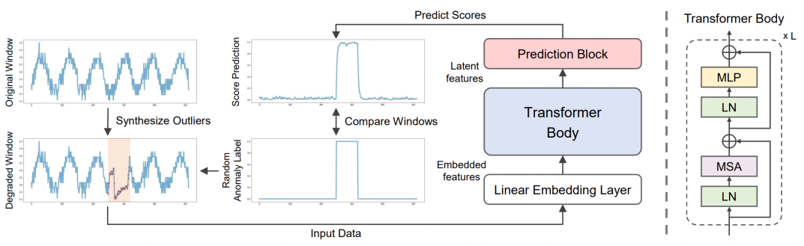

## 2.DCdetector模块

### 论文：DCdetector: Dual Attention Contrastive Representation Learning for Time Series Anomaly Detection [arxiv.org](https://arxiv.org/pdf/2306.10347v2)

> 模块简介：本文提出了一种多尺度双注意对比表征学习模型DCdetector。DCdetector利用一种新颖的双注意不对称设计来创建置换环境和纯对比损失来指导学习过程，从而学习出具有优越判别能力的置换不变表征。大量的实验表明，DCdetector在多个时间序列异常检测基准数据集上取得了最先进的结果。

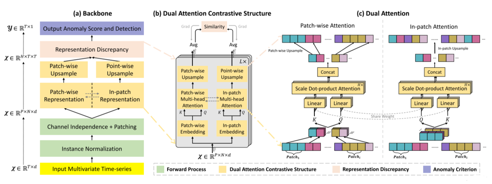

## 3.Spectral Residual模块

### 论文：Time-Series Anomaly Detection Service at Microsoft [arxiv.org](https://arxiv.org/pdf/1906.03821v1)

> 模型简介：本文介绍了我们的异常检测服务的流程和算法，力求准确、高效、通用性强。流程主要包含三个模块：数据获取、实验平台和在线计算。为了解决时间序列异常检测的问题，我们提出了一种基于谱残差(SR)和卷积神经网络(CNN)的新算法。

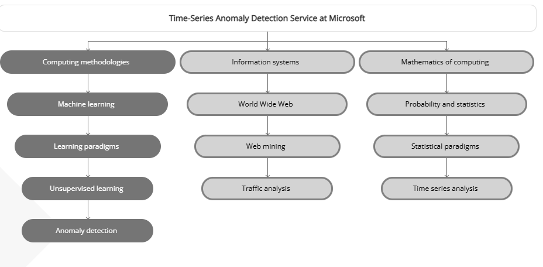

## 4.TODS模块

### 论文：TODS: An Automated Time Series Outlier Detection System [arxiv.org](https://arxiv.org/pdf/2009.09822v3)

> 模块简介：我们介绍了 TODS，这是一种用于研究和工业应用的自动化时间序列异常值检测系统。TODS 是一个高度模块化的系统，支持简单的管道建设。TODS 的基本构建块是 primitive，它是具有超参数的函数的实现。TODS 目前支持 70 种基元，包括数据处理、时间序列处理、特征分析、检测算法和加固模块。用户可以使用这些原语自由构建管道，并使用构建的管道执行端到端异常值检测。

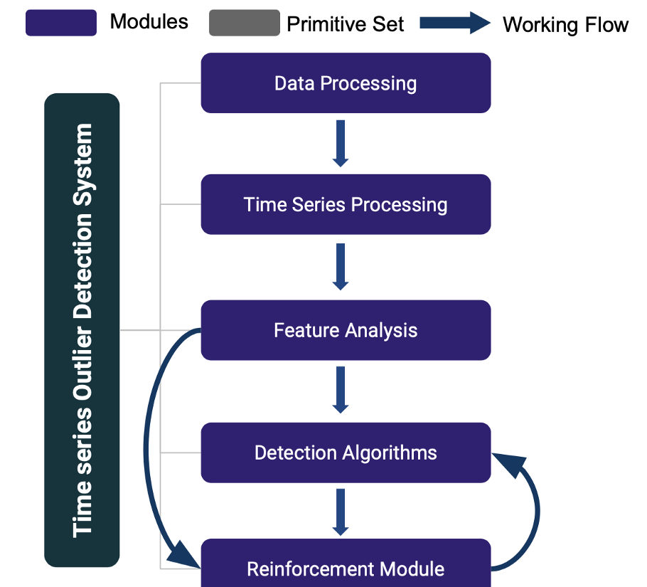

## 5.TranAD模块

### 论文：TranAD: Deep Transformer Networks for Anomaly Detection in Multivariate Time Series Data [arxiv.org](https://arxiv.org/pdf/2201.07284)

> 模块简介：在本文中，我们提出了TranAD，这是一种基于深度transformer网络的异常检测和诊断模型，它使用基于注意力的序列编码器，根据数据中更广泛的时间趋势的知识快速进行推理。TranAD使用基于focus score的自调节来实现鲁棒的多模态特征提取和对抗训练，以获得稳定性。

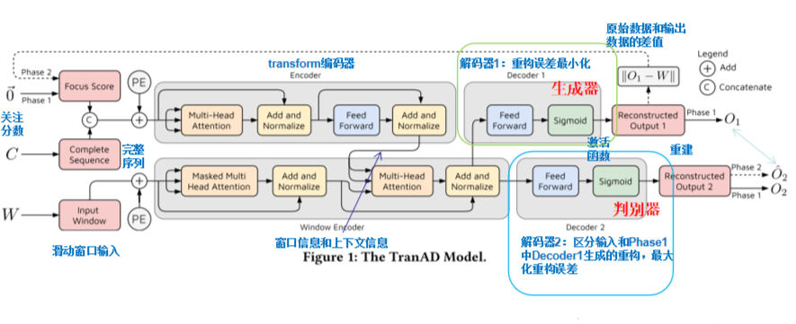

## 6.GDN模块

### 论文：Graph Neural Network-Based Anomaly Detection in Multivariate Time Series [arxiv.org](https://arxiv.org/pdf/2106.06947v1)

> 模块简介：提出一种图偏差网络(GDN)，旨在以图的形式学习传感器之间的关系，然后识别和解释学习模式的偏差。首先将传感器看作节点，计算其嵌入向量，利用点积即求取cos距离的方式得到节点嵌入向量之间的相似度，以此来评判传感器之间是否存在边链接，以此构建邻接矩阵。

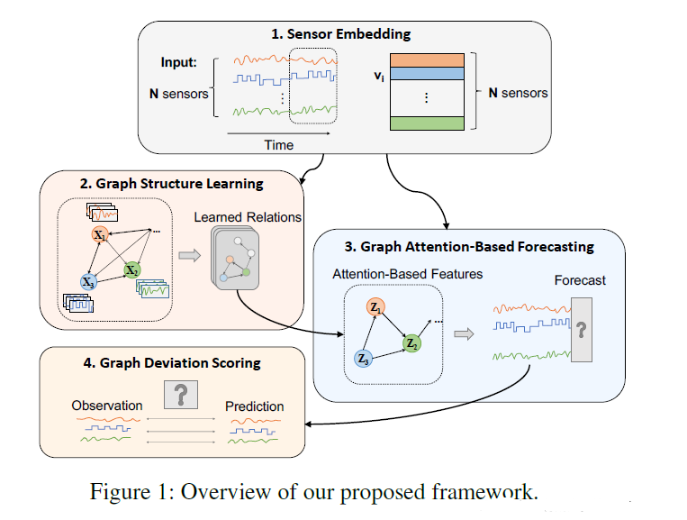

## 7.InterFusion模块

### 论文：Multivariate Time Series Anomaly Detection and Interpretation using Hierarchical Inter-Metric and Temporal Embedding [netman.aiops.org](https://netman.aiops.org/wp-content/uploads/2021/08/KDD21_InterFusion_Li.pdf)

模块简介：作者提出了一种无监督的方法（InterFusion）针对学习MTS数据中不同指标间的依赖和时间顺序上的依赖性进行建模。核心思想是通过两个随机潜变量，结合变分自编码机（VAE）对多维时间序列数据中的正确模式进行建模（使用到预过滤策略）。作者还提出了一种基于马尔科夫链蒙特卡洛的方法，对多维时间序列的异常结果进行解释

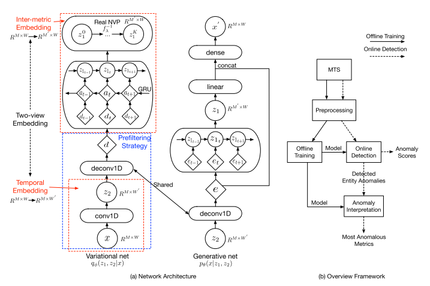

## 8.GANF模块

### 论文：GRAPH-AUGMENTED NORMALIZING FLOWS FOR ANOMALY DETECTION OF MULTIPLE TIME SERIES [arxiv.org](https://arxiv.org/pdf/2202.07857)

> 模块简介：提出了一种名为（GANF）的模块，用于多时间序列的异常检测。与传统方法不同，GANF 所采用的归一化流结合图结构探索了一种有效的多时间序列数据处理模式，该模式描述了每个时间序列基于其自身历史以及与其他相关时间序列关系的概率分布，从而保留了时间序列的相关性和动态特性，以实现更可靠的异常检测。进一步引入了一种基于图的因果关系建模策略，用于在分析过程中逐渐逼近真实的数据生成机制，这有效地保留了时间序列间的依赖信息，并进一步提高检测质量。

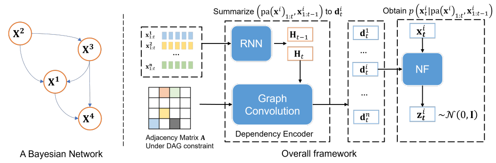

## 9.ANOMALY TRANSFORMER模块

### 论文：ANOMALY TRANSFORMER: TIME SERIES ANOMALY DETECTION WITH ASSOCIATION DISCREPANCY [arxiv.org](https://arxiv.org/pdf/2110.02642)rg：

> 模块简介：提出了一种名为 Anomaly Transformer 的模块，用于时间序列的异常检测。与传统方法不同，Anomaly Transformer 所采用的架构利用了关联差异来处理时间序列，该模块描述了基于自注意力机制来捕获时间序列中的长程依赖关系，从而保留了时间序列的顺序性和依赖性，以实现更可靠的异常检测。进一步引入了一种基于关联差异计算的策略，用于在特征提取过程中量化正常样本与异常样本之间的差异，这有效地保留了时间序列中的关键判别信息，并进一步提高检测质量。

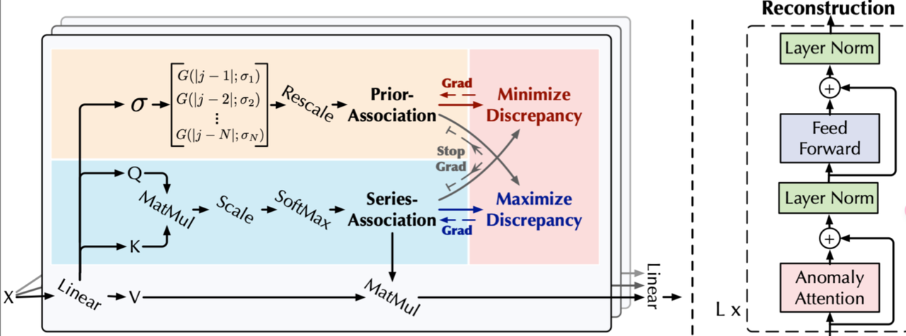

## 10.无监督模型选择模块

### 论文：Unsupervised Model Selection for Time-series Anomaly Detection [arxiv.org](https://arxiv.org/pdf/2210.01078)

模块简介：提出了一种用于时间序列异常检测的无监督模型选择模块。与传统方法不同，该模块所采用的机制考虑了时间序列数据在无监督场景下的特性来进行模型选择，该模块描述了基于特定的无监督评估指标来筛选出最适合时间序列数据的异常检测模型，从而保留了对无监督数据处理的有效性和准确性，以实现更可靠的异常检测。进一步引入了一种基于数据特征与模型适配性分析的策略，用于在模型选择过程中量化不同模型与数据之间的契合程度，这有效地保留了时间序列数据中的关键判别信息，并进一步提高检测质量。

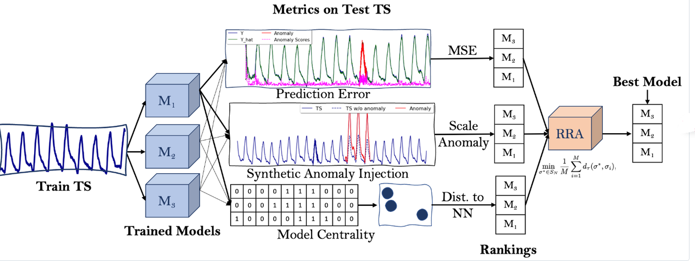

## 11.COUTA模块

### 论文：Calibrated One-class Classification for Unsupervised Time Series Anomaly Detection [arxiv.org](https://arxiv.org/pdf/2207.12201)

模块简介：提出了一种COUTA模块。与传统方法不同，该模块所采用的机制依据时间序列数据在无监督场景下的特性来进行模型选择。该模块描述了基于一系列无监督评估指标来筛选合适的异常检测模型，从而保留了对无监督数据处理的适配性和可靠性，以实现更精准的异常检测。进一步引入了一种基于数据特征与模型匹配性分析的策略，用于在模型选择过程中衡量不同模型与数据之间的契合程度，这有效地保留了时间序列数据中的关键判别信息，并进一步提升检测质量。

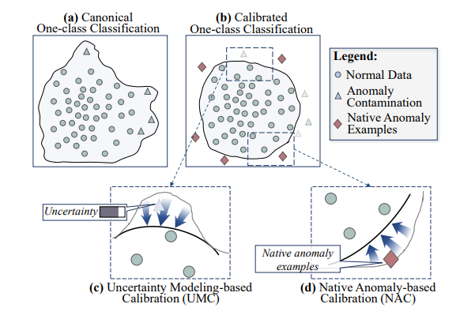

## 12.CityCAN模块

### 论文：CityCAN: Causal Attention Network for CitywideSpatio-Temporal Forecasting [arxiv.org](https://arxiv.org/pdf/2205.14415)

> 模块简介：论文提出了一种用于城市范围内时空预测的Causal Attention Network (CityCAN)。CityCAN利用因果理论来发现城市范围内的有用的时空相关性，并通过隐式干预在潜在层面上学习有用的区域相关性。为了同时捕捉普通和非规则区域的时空相关性，CityCAN引入了一个全局-局部注意编码器，通过校准的注意机制来捕捉本地和全局的时空相关性。

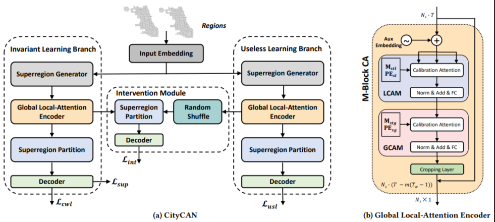

## 13.TCN模块

### 论文：[An Empirical Evaluation of Generic Convolutional and Recurrent Networks for Sequence Modeling](https://arxiv.org/abs/1803.01271)

> 模块简介：论文提出了一种用于序列数据处理的 Temporal Convolutional Network (TCN)。TCN 利用因果卷积和扩张卷积来处理序列中的长短期依赖关系，并通过残差连接在网络结构中有效地传递信息。为了能够处理长序列数据且避免梯度消失或爆炸问题，TCN 引入了扩张卷积机制，通过逐步增大感受野来捕捉序列中的长距离相关性。同时，因果卷积确保了在处理时间序列时只使用过去和当前的信息，保证了预测的合理性，而残差连接则保障了网络训练的稳定性和高效性。

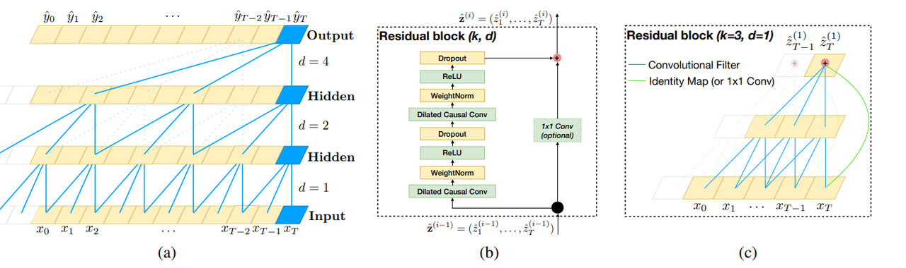

## 14.UnetTSF

### 论文：UnetTSF: A Better Performance Linear Complexity Time Series Prediction Model [arxiv.org](https://arxiv.org/pdf/2401.03001)

> 模块简介：论文提出了一种具有线性复杂度的长时间序列预测模型UnetTSF。它提出了一种适用于时间序列数据的FPN描述结构，成为原始数据描述和二进制分解方法的第三种选择。UnetTSF将Unet网络结构引入时间序列预测领域，并设计实现了一种适用于时间序列预测的Unet网络。在32项测试中，它有31项优于最佳线性模型DLiner，平均降低了10.1%的均方误差和9.1%的平均绝对误差，在时间序列预测任务中展现了卓越的性能和线性复杂度优势。

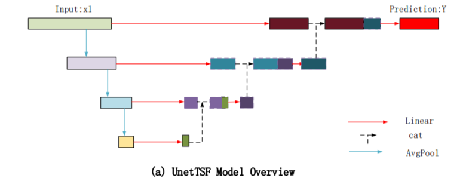

## 15.PYRAFORMER模块

### 论文：PYRAFORMER: LOW-COMPLEXITY PYRAMIDAL ATTENTION FOR LONG-RANGE TIME SERIES MODELING AND FORECASTIN [openreview.net](https://openreview.net/pdf?id=0EXmFzUn5I)

> 模块简介：本文提出了一种基于金字塔注意力的Pyraformer模型，通过多分辨率表示来捕捉时间序列的不同范围的时间依赖关系。具体来说，作者引入了金字塔注意力模块（PAM），其中的跨尺度树结构总结了不同分辨率的特征，而内部尺度的相邻连接则模拟了不同范围的时间依赖关系。在一定条件下，Pyraformer的信号传播路径的最大长度是一个常数（即O（1）），而其时间和空间复杂度与序列长度L成线性关系。

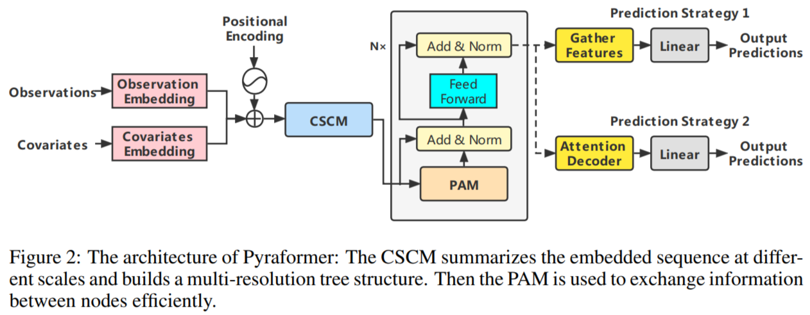

## 16.FECAM

### FECAM: Frequency Enhanced Channel Attention Mechanism forTime Series Forecasting [arxiv.org](https://arxiv.org/pdf/2212.01209)

> 模块简介：论文提出了基于离散余弦变换的频域增强通道机制（FECAM），可以避免由于有问题的周期性导致的高频噪声。通过在频域建模，FECAM可以给不同通道分配通道权重，并学习每个通道不同频率的重要性，从而学习时间序列的频域表示。该模块可以提高现有主流网络的预测能力，只需几行代码，即可在LSTM上降低35.99%的MSE，在Reformer上降低10.01%，在Informer上降低8.71%，在Autoformer上降低8.29%，在Transformer上降低8.06%等，计算成本很小。

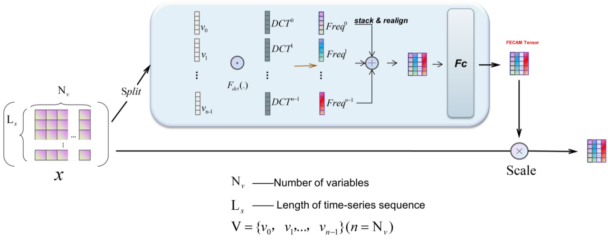

